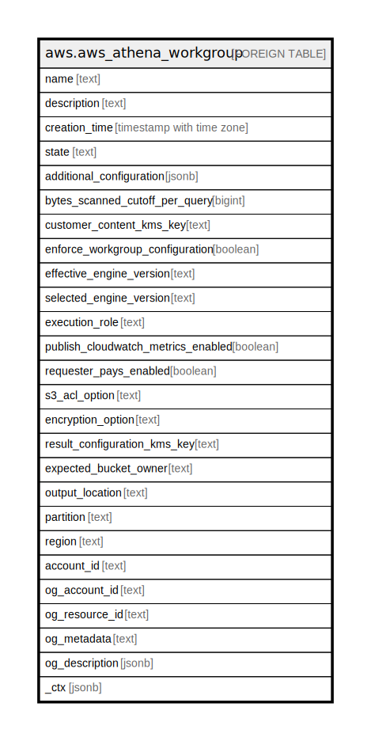

# aws.aws_athena_workgroup

## Description

AWS Athena Workgroup

## Columns

| Name | Type | Default | Nullable | Children | Parents | Comment |
| ---- | ---- | ------- | -------- | -------- | ------- | ------- |
| name | text |  | true |  |  | The workgroup name. |
| description | text |  | true |  |  | The workgroup description. |
| creation_time | timestamp with time zone |  | true |  |  | The date and time the workgroup was created. |
| state | text |  | true |  |  | The state of the workgroup. |
| additional_configuration | jsonb |  | true |  |  | Specifies a user defined JSON string that is passed to the notebook engine. |
| bytes_scanned_cutoff_per_query | bigint |  | true |  |  | The upper data usage limit (cutoff) for the amount of bytes a single query in a workgroup is allowed to scan. |
| customer_content_kms_key | text |  | true |  |  | Specifies the KMS key that is used to encrypt the user's data stores in Athena. |
| enforce_workgroup_configuration | boolean |  | true |  |  | If set to "true", the settings for the workgroup override client-side settings. |
| effective_engine_version | text |  | true |  |  | The engine version on which the query runs. |
| selected_engine_version | text |  | true |  |  | The engine version requested by the user. |
| execution_role | text |  | true |  |  | Role used in a notebook session for accessing the user's resources. |
| publish_cloudwatch_metrics_enabled | boolean |  | true |  |  | Indicates that the Amazon CloudWatch metrics are enabled for the workgroup. |
| requester_pays_enabled | boolean |  | true |  |  | If set to true, allows members assigned to a workgroup to reference Amazon S3 Requester Pays buckets in queries. |
| s3_acl_option | text |  | true |  |  | The Amazon S3 canned ACL that Athena should specify when storing query results. |
| encryption_option | text |  | true |  |  | Indicates whether Amazon S3 server-side encryption with Amazon S3-managed keys (SSE_S3), server-side encryption with KMS-managed keys (SSE_KMS), or client-side encryption with KMS-managed keys (CSE_KMS) is used. |
| result_configuration_kms_key | text |  | true |  |  | For SSE_KMS and CSE_KMS, this is the KMS key ARN or ID. |
| expected_bucket_owner | text |  | true |  |  | The Amazon Web Services account ID that you expect to be the owner of the Amazon S3 bucket specified by ResultConfiguration$OutputLocation. |
| output_location | text |  | true |  |  | The location in Amazon S3 where your query results are stored. |
| partition | text |  | true |  |  | The AWS partition in which the resource is located (aws, aws-cn, or aws-us-gov). |
| region | text |  | true |  |  | The AWS Region in which the resource is located. |
| account_id | text |  | true |  |  | The AWS Account ID in which the resource is located. |
| og_account_id | text |  | true |  |  | The Platform Account ID in which the resource is located. |
| og_resource_id | text |  | true |  |  | The unique ID of the resource in opengovernance. |
| og_metadata | text |  | true |  |  | Platform Metadata of the AWS resource. |
| og_description | jsonb |  | true |  |  | The full model description of the resource |
| _ctx | jsonb |  | true |  |  | Steampipe context in JSON form, e.g. connection_name. |

## Relations

---

> Generated by [tbls](https://github.com/k1LoW/tbls)
