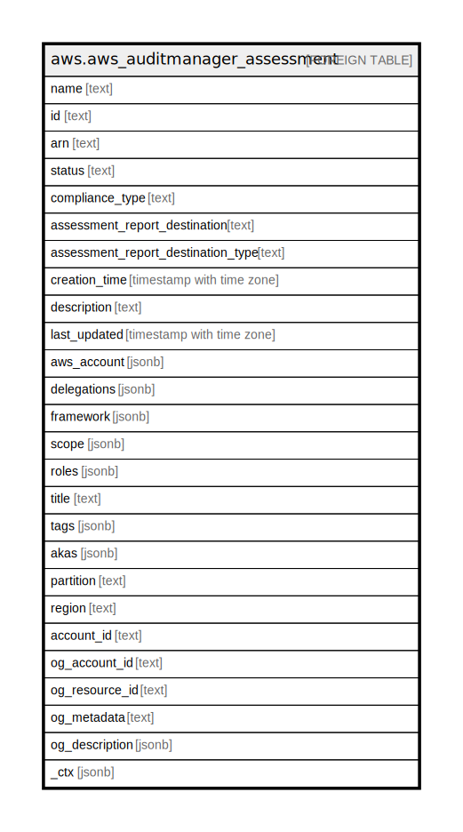

# aws.aws_auditmanager_assessment

## Description

AWS Audit Manager Assessment

## Columns

| Name | Type | Default | Nullable | Children | Parents | Comment |
| ---- | ---- | ------- | -------- | -------- | ------- | ------- |
| name | text |  | true |  |  | The name of the assessment. |
| id | text |  | true |  |  | An unique identifier for the assessment. |
| arn | text |  | true |  |  | The Amazon Resource Name (ARN) of the assessment. |
| status | text |  | true |  |  | The current status of the assessment. |
| compliance_type | text |  | true |  |  | The name of the compliance standard related to the assessment. |
| assessment_report_destination | text |  | true |  |  | The destination of the assessment report. |
| assessment_report_destination_type | text |  | true |  |  | The destination type, such as Amazon S3. |
| creation_time | timestamp with time zone |  | true |  |  | Specifies when the assessment was created. |
| description | text |  | true |  |  | The description of the assessment. |
| last_updated | timestamp with time zone |  | true |  |  | The time of the most recent update. |
| aws_account | jsonb |  | true |  |  | The AWS account associated with the assessment. |
| delegations | jsonb |  | true |  |  | The delegations associated with the assessment. |
| framework | jsonb |  | true |  |  | The framework from which the assessment was created. |
| scope | jsonb |  | true |  |  | The wrapper of AWS accounts and services in scope for the assessment. |
| roles | jsonb |  | true |  |  | The roles associated with the assessment. |
| title | text |  | true |  |  | Title of the resource. |
| tags | jsonb |  | true |  |  | A map of tags for the resource. |
| akas | jsonb |  | true |  |  | Array of globally unique identifier strings (also known as) for the resource. |
| partition | text |  | true |  |  | The AWS partition in which the resource is located (aws, aws-cn, or aws-us-gov). |
| region | text |  | true |  |  | The AWS Region in which the resource is located. |
| account_id | text |  | true |  |  | The AWS Account ID in which the resource is located. |
| og_account_id | text |  | true |  |  | The Platform Account ID in which the resource is located. |
| og_resource_id | text |  | true |  |  | The unique ID of the resource in opengovernance. |
| og_metadata | text |  | true |  |  | Platform Metadata of the AWS resource. |
| og_description | jsonb |  | true |  |  | The full model description of the resource |
| _ctx | jsonb |  | true |  |  | Steampipe context in JSON form, e.g. connection_name. |

## Relations

---

> Generated by [tbls](https://github.com/k1LoW/tbls)
