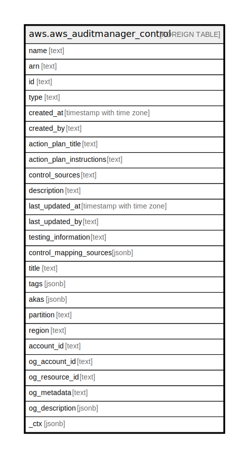

# aws.aws_auditmanager_control

## Description

AWS Audit Manager Control

## Columns

| Name | Type | Default | Nullable | Children | Parents | Comment |
| ---- | ---- | ------- | -------- | -------- | ------- | ------- |
| name | text |  | true |  |  | The name of the specified control. |
| arn | text |  | true |  |  | The Amazon Resource Name (ARN) of the specified control. |
| id | text |  | true |  |  | An unique identifier for the specified control. |
| type | text |  | true |  |  | The type of control, such as custom or standard. |
| created_at | timestamp with time zone |  | true |  |  | Specifies when the control was created. |
| created_by | text |  | true |  |  | The IAM user or role that created the control. |
| action_plan_title | text |  | true |  |  | The title of the action plan for remediating the control. |
| action_plan_instructions | text |  | true |  |  | The recommended actions to carry out if the control is not fulfilled. |
| control_sources | text |  | true |  |  | The data source that determines from where AWS Audit Manager collects evidence for the control. |
| description | text |  | true |  |  | The description of the specified control. |
| last_updated_at | timestamp with time zone |  | true |  |  | Specifies when the control was most recently updated. |
| last_updated_by | text |  | true |  |  | The IAM user or role that most recently updated the control. |
| testing_information | text |  | true |  |  | The steps to follow to determine if the control has been satisfied. |
| control_mapping_sources | jsonb |  | true |  |  | The data mapping sources for the specified control. |
| title | text |  | true |  |  | Title of the resource. |
| tags | jsonb |  | true |  |  | A map of tags for the resource. |
| akas | jsonb |  | true |  |  | Array of globally unique identifier strings (also known as) for the resource. |
| partition | text |  | true |  |  | The AWS partition in which the resource is located (aws, aws-cn, or aws-us-gov). |
| region | text |  | true |  |  | The AWS Region in which the resource is located. |
| account_id | text |  | true |  |  | The AWS Account ID in which the resource is located. |
| og_account_id | text |  | true |  |  | The Platform Account ID in which the resource is located. |
| og_resource_id | text |  | true |  |  | The unique ID of the resource in opengovernance. |
| og_metadata | text |  | true |  |  | Platform Metadata of the AWS resource. |
| og_description | jsonb |  | true |  |  | The full model description of the resource |
| _ctx | jsonb |  | true |  |  | Steampipe context in JSON form, e.g. connection_name. |

## Relations

---

> Generated by [tbls](https://github.com/k1LoW/tbls)
