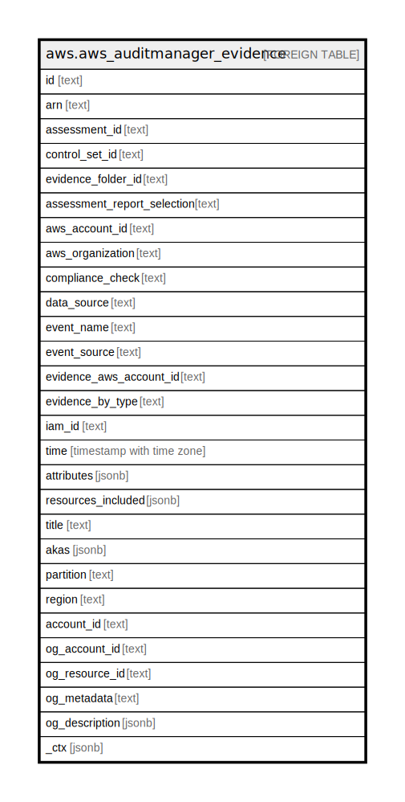

# aws.aws_auditmanager_evidence

## Description

AWS Audit Manager Evidence

## Columns

| Name | Type | Default | Nullable | Children | Parents | Comment |
| ---- | ---- | ------- | -------- | -------- | ------- | ------- |
| id | text |  | true |  |  | The identifier for the evidence. |
| arn | text |  | true |  |  | The Amazon Resource Name (ARN) specifying the evidence. |
| assessment_id | text |  | true |  |  | An unique identifier for the assessment. |
| control_set_id | text |  | true |  |  | The identifier for the control set. |
| evidence_folder_id | text |  | true |  |  | The identifier for the folder in which the evidence is stored. |
| assessment_report_selection | text |  | true |  |  | Specifies whether the evidence is included in the assessment report. |
| aws_account_id | text |  | true |  |  | The identifier for the specified AWS account. |
| aws_organization | text |  | true |  |  | The AWS account from which the evidence is collected, and its AWS organization path. |
| compliance_check | text |  | true |  |  | The evaluation status for evidence that falls under the compliance check category. |
| data_source | text |  | true |  |  | The data source from which the specified evidence was collected. |
| event_name | text |  | true |  |  | The name of the specified evidence event. |
| event_source | text |  | true |  |  | The AWS service from which the evidence is collected. |
| evidence_aws_account_id | text |  | true |  |  | The identifier for the specified AWS account. |
| evidence_by_type | text |  | true |  |  | The type of automated evidence. |
| iam_id | text |  | true |  |  | The unique identifier for the IAM user or role associated with the evidence. |
| time | timestamp with time zone |  | true |  |  | The timestamp that represents when the evidence was collected. |
| attributes | jsonb |  | true |  |  | The names and values used by the evidence event |
| resources_included | jsonb |  | true |  |  | The list of resources assessed to generate the evidence. |
| title | text |  | true |  |  | Title of the resource. |
| akas | jsonb |  | true |  |  | Array of globally unique identifier strings (also known as) for the resource. |
| partition | text |  | true |  |  | The AWS partition in which the resource is located (aws, aws-cn, or aws-us-gov). |
| region | text |  | true |  |  | The AWS Region in which the resource is located. |
| account_id | text |  | true |  |  | The AWS Account ID in which the resource is located. |
| og_account_id | text |  | true |  |  | The Platform Account ID in which the resource is located. |
| og_resource_id | text |  | true |  |  | The unique ID of the resource in opengovernance. |
| og_metadata | text |  | true |  |  | Platform Metadata of the AWS resource. |
| og_description | jsonb |  | true |  |  | The full model description of the resource |
| _ctx | jsonb |  | true |  |  | Steampipe context in JSON form, e.g. connection_name. |

## Relations

---

> Generated by [tbls](https://github.com/k1LoW/tbls)
