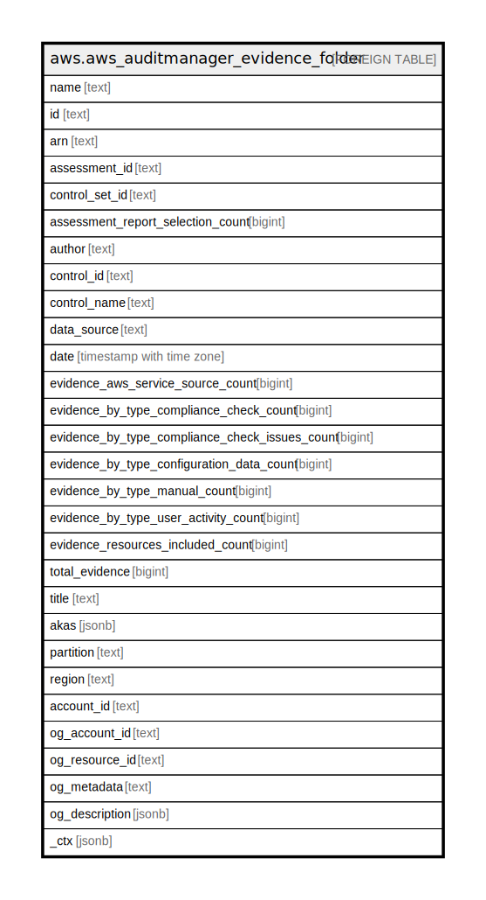

# aws.aws_auditmanager_evidence_folder

## Description

AWS Audit Manager Evidence Folder

## Columns

| Name | Type | Default | Nullable | Children | Parents | Comment |
| ---- | ---- | ------- | -------- | -------- | ------- | ------- |
| name | text |  | true |  |  | The name of the specified evidence folder. |
| id | text |  | true |  |  | The identifier for the folder in which evidence is stored. |
| arn | text |  | true |  |  | The Amazon Resource Name (ARN) specifying the evidence folder. |
| assessment_id | text |  | true |  |  | The identifier for the specified assessment. |
| control_set_id | text |  | true |  |  | The identifier for the control set. |
| assessment_report_selection_count | bigint |  | true |  |  | The total count of evidence included in the assessment report. |
| author | text |  | true |  |  | The name of the user who created the evidence folder. |
| control_id | text |  | true |  |  | The unique identifier for the specified control. |
| control_name | text |  | true |  |  | The name of the control. |
| data_source | text |  | true |  |  | The AWS service from which the evidence was collected. |
| date | timestamp with time zone |  | true |  |  | The date when the first evidence was added to the evidence folder. |
| evidence_aws_service_source_count | bigint |  | true |  |  | The total number of AWS resources assessed to generate the evidence. |
| evidence_by_type_compliance_check_count | bigint |  | true |  |  | The number of evidence that falls under the compliance check category. |
| evidence_by_type_compliance_check_issues_count | bigint |  | true |  |  | The total number of issues that were reported directly from AWS Security Hub, AWS Config, or both. |
| evidence_by_type_configuration_data_count | bigint |  | true |  |  | The number of evidence that falls under the configuration data category. |
| evidence_by_type_manual_count | bigint |  | true |  |  | The number of evidence that falls under the manual category. |
| evidence_by_type_user_activity_count | bigint |  | true |  |  | The number of evidence that falls under the user activity category. |
| evidence_resources_included_count | bigint |  | true |  |  | The amount of evidence included in the evidence folder. |
| total_evidence | bigint |  | true |  |  | The total amount of evidence in the evidence folder. |
| title | text |  | true |  |  | Title of the resource. |
| akas | jsonb |  | true |  |  | Array of globally unique identifier strings (also known as) for the resource. |
| partition | text |  | true |  |  | The AWS partition in which the resource is located (aws, aws-cn, or aws-us-gov). |
| region | text |  | true |  |  | The AWS Region in which the resource is located. |
| account_id | text |  | true |  |  | The AWS Account ID in which the resource is located. |
| og_account_id | text |  | true |  |  | The Platform Account ID in which the resource is located. |
| og_resource_id | text |  | true |  |  | The unique ID of the resource in opengovernance. |
| og_metadata | text |  | true |  |  | Platform Metadata of the AWS resource. |
| og_description | jsonb |  | true |  |  | The full model description of the resource |
| _ctx | jsonb |  | true |  |  | Steampipe context in JSON form, e.g. connection_name. |

## Relations

---

> Generated by [tbls](https://github.com/k1LoW/tbls)
