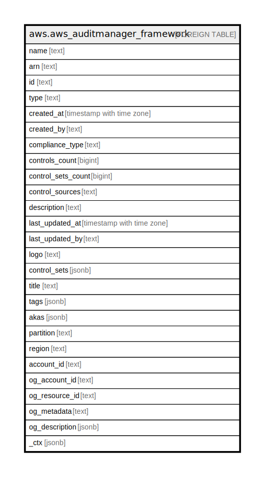

# aws.aws_auditmanager_framework

## Description

AWS Audit Manager Framework

## Columns

| Name | Type | Default | Nullable | Children | Parents | Comment |
| ---- | ---- | ------- | -------- | -------- | ------- | ------- |
| name | text |  | true |  |  | The name of the specified framework. |
| arn | text |  | true |  |  | The Amazon Resource Name (ARN) of the framework. |
| id | text |  | true |  |  | The unique identified for the specified framework. |
| type | text |  | true |  |  | The framework type, such as standard or custom. |
| created_at | timestamp with time zone |  | true |  |  | Specifies when the framework was created. |
| created_by | text |  | true |  |  | The IAM user or role that created the framework. |
| compliance_type | text |  | true |  |  | The compliance type that the new custom framework supports, such as CIS or HIPAA. |
| controls_count | bigint |  | true |  |  | The number of controls associated with the specified framework. |
| control_sets_count | bigint |  | true |  |  | The number of control sets associated with the specified framework. |
| control_sources | text |  | true |  |  | The sources from which AWS Audit Manager collects evidence for the control. |
| description | text |  | true |  |  | The description of the specified framework. |
| last_updated_at | timestamp with time zone |  | true |  |  | Specifies when the framework was most recently updated. |
| last_updated_by | text |  | true |  |  | The IAM user or role that most recently updated the framework. |
| logo | text |  | true |  |  | The logo associated with the framework. |
| control_sets | jsonb |  | true |  |  | The control sets associated with the framework. |
| title | text |  | true |  |  | Title of the resource. |
| tags | jsonb |  | true |  |  | A map of tags for the resource. |
| akas | jsonb |  | true |  |  | Array of globally unique identifier strings (also known as) for the resource. |
| partition | text |  | true |  |  | The AWS partition in which the resource is located (aws, aws-cn, or aws-us-gov). |
| region | text |  | true |  |  | The AWS Region in which the resource is located. |
| account_id | text |  | true |  |  | The AWS Account ID in which the resource is located. |
| og_account_id | text |  | true |  |  | The Platform Account ID in which the resource is located. |
| og_resource_id | text |  | true |  |  | The unique ID of the resource in opengovernance. |
| og_metadata | text |  | true |  |  | Platform Metadata of the AWS resource. |
| og_description | jsonb |  | true |  |  | The full model description of the resource |
| _ctx | jsonb |  | true |  |  | Steampipe context in JSON form, e.g. connection_name. |

## Relations

---

> Generated by [tbls](https://github.com/k1LoW/tbls)
