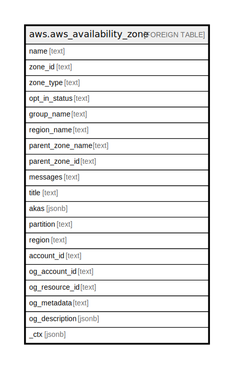

# aws.aws_availability_zone

## Description

AWS Availability Zone

## Columns

| Name | Type | Default | Nullable | Children | Parents | Comment |
| ---- | ---- | ------- | -------- | -------- | ------- | ------- |
| name | text |  | true |  |  | The name of the Availability Zone, Local Zone, or Wavelength Zone |
| zone_id | text |  | true |  |  | The ID of the Availability Zone, Local Zone, or Wavelength Zone. |
| zone_type | text |  | true |  |  | The type of zone. The valid values are availability-zone, local-zone, and wavelength-zone. |
| opt_in_status | text |  | true |  |  | For Availability Zones, this parameter always has the value of opt-in-not-required. For Local Zones and Wavelength Zones, this parameter is the opt-in status. The possible values are opted-in, and not-opted-in. |
| group_name | text |  | true |  |  | For Availability Zones, this parameter has the same value as the Region name. For Local Zones, the name of the associated group, for example us-west-2-lax-1. For Wavelength Zones, the name of the associated group, for example us-east-1-wl1-bos-wlz-1. |
| region_name | text |  | true |  |  | The name of the Region. |
| parent_zone_name | text |  | true |  |  | The name of the zone that handles some of the Local Zone or Wavelength Zone control plane operations, such as API calls. |
| parent_zone_id | text |  | true |  |  | The ID of the zone that handles some of the Local Zone or Wavelength Zone control plane operations, such as API calls |
| messages | text |  | true |  |  | Any messages about the Availability Zone, Local Zone, or Wavelength Zone. |
| title | text |  | true |  |  | Title of the resource. |
| akas | jsonb |  | true |  |  | Array of globally unique identifier strings (also known as) for the resource. |
| partition | text |  | true |  |  | The AWS partition in which the resource is located (aws, aws-cn, or aws-us-gov). |
| region | text |  | true |  |  | The AWS Region in which the resource is located. |
| account_id | text |  | true |  |  | The AWS Account ID in which the resource is located. |
| og_account_id | text |  | true |  |  | The Platform Account ID in which the resource is located. |
| og_resource_id | text |  | true |  |  | The unique ID of the resource in opengovernance. |
| og_metadata | text |  | true |  |  | Platform Metadata of the AWS resource. |
| og_description | jsonb |  | true |  |  | The full model description of the resource |
| _ctx | jsonb |  | true |  |  | Steampipe context in JSON form, e.g. connection_name. |

## Relations

---

> Generated by [tbls](https://github.com/k1LoW/tbls)
