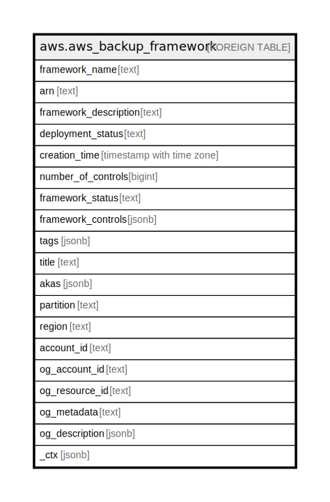

# aws.aws_backup_framework

## Description

AWS Backup Framework

## Columns

| Name | Type | Default | Nullable | Children | Parents | Comment |
| ---- | ---- | ------- | -------- | -------- | ------- | ------- |
| framework_name | text |  | true |  |  | The unique name of a backup framework. |
| arn | text |  | true |  |  | An Amazon Resource Name (ARN) that uniquely identifies a backup framework resource. |
| framework_description | text |  | true |  |  | An optional description of the backup framework. |
| deployment_status | text |  | true |  |  | The deployment status of a backup framework. |
| creation_time | timestamp with time zone |  | true |  |  | The date and time that a framework was created. |
| number_of_controls | bigint |  | true |  |  | The number of controls contained by the framework. |
| framework_status | text |  | true |  |  | The framework status based on recording statuses for resources governed by the framework (ACTIVE | PARTIALLY_ACTIVE | INACTIVE | UNAVAILABLE). |
| framework_controls | jsonb |  | true |  |  | A list of the controls that make up the framework. Each control in the list has a name, input parameters, and scope. |
| tags | jsonb |  | true |  |  | A map of tags for the resource. |
| title | text |  | true |  |  | Title of the resource. |
| akas | jsonb |  | true |  |  | Array of globally unique identifier strings (also known as) for the resource. |
| partition | text |  | true |  |  | The AWS partition in which the resource is located (aws, aws-cn, or aws-us-gov). |
| region | text |  | true |  |  | The AWS Region in which the resource is located. |
| account_id | text |  | true |  |  | The AWS Account ID in which the resource is located. |
| og_account_id | text |  | true |  |  | The Platform Account ID in which the resource is located. |
| og_resource_id | text |  | true |  |  | The unique ID of the resource in opengovernance. |
| og_metadata | text |  | true |  |  | Platform Metadata of the AWS resource. |
| og_description | jsonb |  | true |  |  | The full model description of the resource |
| _ctx | jsonb |  | true |  |  | Steampipe context in JSON form, e.g. connection_name. |

## Relations

---

> Generated by [tbls](https://github.com/k1LoW/tbls)
