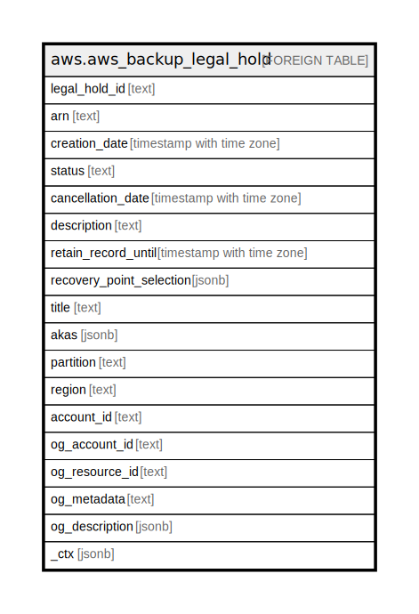

# aws.aws_backup_legal_hold

## Description

AWS Backup Legal Hold

## Columns

| Name | Type | Default | Nullable | Children | Parents | Comment |
| ---- | ---- | ------- | -------- | -------- | ------- | ------- |
| legal_hold_id | text |  | true |  |  | ID of specific legal hold on one or more recovery points. |
| arn | text |  | true |  |  | This is an Amazon Resource Number (ARN) that uniquely identifies the legal hold. |
| creation_date | timestamp with time zone |  | true |  |  | This is the time in number format when legal hold was created. |
| status | text |  | true |  |  | This is the status of the legal hold. Statuses can be ACTIVE, CREATING, CANCELED, and CANCELING. |
| cancellation_date | timestamp with time zone |  | true |  |  | This is the time in number format when legal hold was cancelled. |
| description | text |  | true |  |  | This is the description of a legal hold. |
| retain_record_until | timestamp with time zone |  | true |  |  | This is the date and time until which the legal hold record will be retained. |
| recovery_point_selection | jsonb |  | true |  |  | This specifies criteria to assign a set of resources, such as resource types or backup vaults. |
| title | text |  | true |  |  | Title of the resource. |
| akas | jsonb |  | true |  |  | Array of globally unique identifier strings (also known as) for the resource. |
| partition | text |  | true |  |  | The AWS partition in which the resource is located (aws, aws-cn, or aws-us-gov). |
| region | text |  | true |  |  | The AWS Region in which the resource is located. |
| account_id | text |  | true |  |  | The AWS Account ID in which the resource is located. |
| og_account_id | text |  | true |  |  | The Platform Account ID in which the resource is located. |
| og_resource_id | text |  | true |  |  | The unique ID of the resource in opengovernance. |
| og_metadata | text |  | true |  |  | Platform Metadata of the AWS resource. |
| og_description | jsonb |  | true |  |  | The full model description of the resource |
| _ctx | jsonb |  | true |  |  | Steampipe context in JSON form, e.g. connection_name. |

## Relations

---

> Generated by [tbls](https://github.com/k1LoW/tbls)
