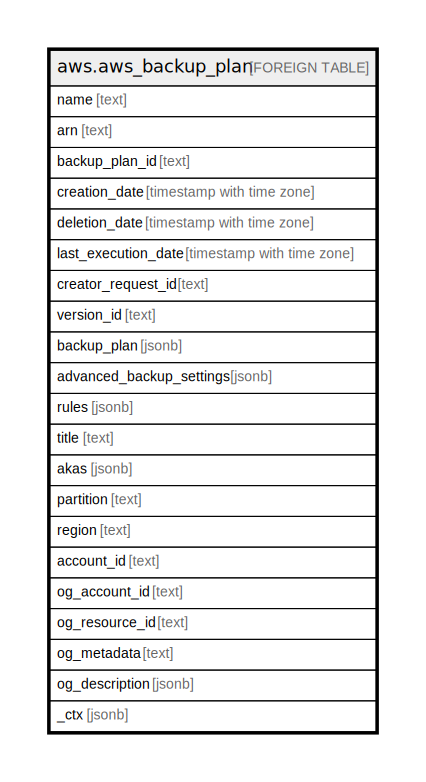

# aws.aws_backup_plan

## Description

AWS Backup Plan

## Columns

| Name | Type | Default | Nullable | Children | Parents | Comment |
| ---- | ---- | ------- | -------- | -------- | ------- | ------- |
| name | text |  | true |  |  | The display name of a saved backup plan. |
| arn | text |  | true |  |  | An Amazon Resource Name (ARN) that uniquely identifies a backup plan. |
| backup_plan_id | text |  | true |  |  | Specifies the id to identify a backup plan uniquely. |
| creation_date | timestamp with time zone |  | true |  |  | The date and time a resource backup plan is created. |
| deletion_date | timestamp with time zone |  | true |  |  | The date and time a backup plan is deleted. |
| last_execution_date | timestamp with time zone |  | true |  |  | The last time a job to back up resources was run with this rule. |
| creator_request_id | text |  | true |  |  | An unique string that identifies the request and allows failed requests to be retried without the risk of running the operation twice. |
| version_id | text |  | true |  |  | Unique, randomly generated, Unicode, UTF-8 encoded strings that are at most 1,024 bytes long. Version IDs cannot be edited. |
| backup_plan | jsonb |  | true |  |  | Specifies the body of a backup plan. |
| advanced_backup_settings | jsonb |  | true |  |  | Contains a list of BackupOptions for a resource type. |
| rules | jsonb |  | true |  |  | Contains a list of Rules for a resource type. |
| title | text |  | true |  |  | Title of the resource. |
| akas | jsonb |  | true |  |  | Array of globally unique identifier strings (also known as) for the resource. |
| partition | text |  | true |  |  | The AWS partition in which the resource is located (aws, aws-cn, or aws-us-gov). |
| region | text |  | true |  |  | The AWS Region in which the resource is located. |
| account_id | text |  | true |  |  | The AWS Account ID in which the resource is located. |
| og_account_id | text |  | true |  |  | The Platform Account ID in which the resource is located. |
| og_resource_id | text |  | true |  |  | The unique ID of the resource in opengovernance. |
| og_metadata | text |  | true |  |  | Platform Metadata of the AWS resource. |
| og_description | jsonb |  | true |  |  | The full model description of the resource |
| _ctx | jsonb |  | true |  |  | Steampipe context in JSON form, e.g. connection_name. |

## Relations

---

> Generated by [tbls](https://github.com/k1LoW/tbls)
