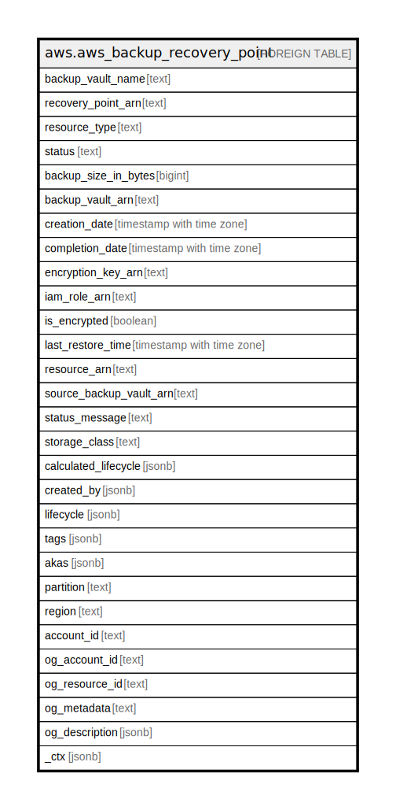

# aws.aws_backup_recovery_point

## Description

AWS Backup Recovery Point

## Columns

| Name | Type | Default | Nullable | Children | Parents | Comment |
| ---- | ---- | ------- | -------- | -------- | ------- | ------- |
| backup_vault_name | text |  | true |  |  | The name of a logical container where backups are stored. |
| recovery_point_arn | text |  | true |  |  | An ARN that uniquely identifies a recovery point. |
| resource_type | text |  | true |  |  | The type of Amazon Web Services resource to save as a recovery point. |
| status | text |  | true |  |  | A status code specifying the state of the recovery point. |
| backup_size_in_bytes | bigint |  | true |  |  | The size, in bytes, of a backup. |
| backup_vault_arn | text |  | true |  |  | An ARN that uniquely identifies a backup vault. |
| creation_date | timestamp with time zone |  | true |  |  | The date and time that a recovery point is created. |
| completion_date | timestamp with time zone |  | true |  |  | The date and time that a job to create a recovery point is completed. |
| encryption_key_arn | text |  | true |  |  | The server-side encryption key used to protect your backups. |
| iam_role_arn | text |  | true |  |  | Specifies the IAM role ARN used to create the target recovery point. |
| is_encrypted | boolean |  | true |  |  | A Boolean value that is returned as TRUE if the specified recovery point is encrypted, or FALSE if the recovery point is not encrypted. |
| last_restore_time | timestamp with time zone |  | true |  |  | The date and time that a recovery point was last restored. |
| resource_arn | text |  | true |  |  | An ARN that uniquely identifies a saved resource. |
| source_backup_vault_arn | text |  | true |  |  | An Amazon Resource Name (ARN) that uniquely identifies the source vault where the resource was originally backed up in. |
| status_message | text |  | true |  |  | A status message explaining the reason for the recovery point deletion failure. |
| storage_class | text |  | true |  |  | Specifies the storage class of the recovery point. Valid values are WARM or COLD. |
| calculated_lifecycle | jsonb |  | true |  |  | An object containing DeleteAt and MoveToColdStorageAt timestamps. |
| created_by | jsonb |  | true |  |  | Contains identifying information about the creation of a recovery point, including the BackupPlanArn, BackupPlanId, BackupPlanVersion, and BackupRuleId of the backup plan used to create it. |
| lifecycle | jsonb |  | true |  |  | The lifecycle defines when a protected resource is transitioned to cold storage and when it expires. |
| tags | jsonb |  | true |  |  | A map of tags for the resource. |
| akas | jsonb |  | true |  |  | Array of globally unique identifier strings (also known as) for the resource. |
| partition | text |  | true |  |  | The AWS partition in which the resource is located (aws, aws-cn, or aws-us-gov). |
| region | text |  | true |  |  | The AWS Region in which the resource is located. |
| account_id | text |  | true |  |  | The AWS Account ID in which the resource is located. |
| og_account_id | text |  | true |  |  | The Platform Account ID in which the resource is located. |
| og_resource_id | text |  | true |  |  | The unique ID of the resource in opengovernance. |
| og_metadata | text |  | true |  |  | Platform Metadata of the AWS resource. |
| og_description | jsonb |  | true |  |  | The full model description of the resource |
| _ctx | jsonb |  | true |  |  | Steampipe context in JSON form, e.g. connection_name. |

## Relations

---

> Generated by [tbls](https://github.com/k1LoW/tbls)
