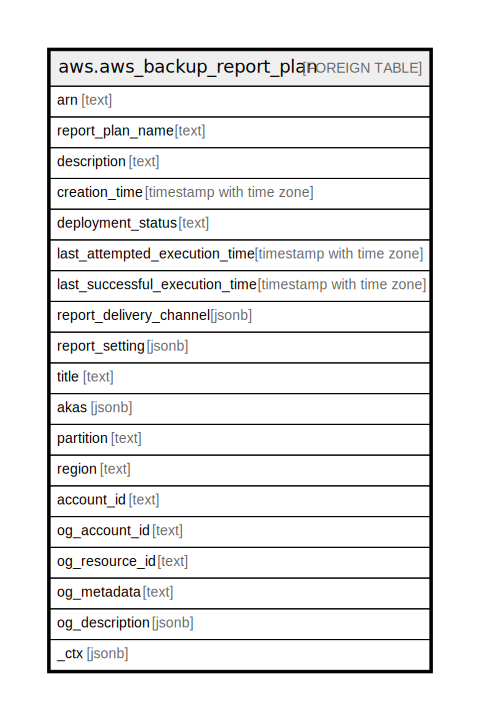

# aws.aws_backup_report_plan

## Description

AWS Backup Report Plan

## Columns

| Name | Type | Default | Nullable | Children | Parents | Comment |
| ---- | ---- | ------- | -------- | -------- | ------- | ------- |
| arn | text |  | true |  |  | An Amazon Resource Name (ARN) that uniquely identifies a resource. |
| report_plan_name | text |  | true |  |  | The unique name of the report plan. |
| description | text |  | true |  |  | An optional description of the report plan with a maximum 1,024 characters. |
| creation_time | timestamp with time zone |  | true |  |  | The date and time that a report plan is created, in Unix format and Coordinated Universal Time (UTC). |
| deployment_status | text |  | true |  |  | The deployment status of a report plan. The statuses are CREATE_IN_PROGRESS, UPDATE_IN_PROGRESS, DELETE_IN_PROGRESS, and COMPLETED. |
| last_attempted_execution_time | timestamp with time zone |  | true |  |  | The date and time that a report job associated with this report plan last attempted to run, in Unix format and Coordinated Universal Time (UTC). |
| last_successful_execution_time | timestamp with time zone |  | true |  |  | The date and time that a report job associated with this report plan last successfully ran, in Unix format and Coordinated Universal Time (UTC). |
| report_delivery_channel | jsonb |  | true |  |  | Contains information about where and how to deliver your reports, specifically your Amazon S3 bucket name, S3 key prefix, and the formats of your reports. |
| report_setting | jsonb |  | true |  |  | Identifies the report template for the report. Reports are built using a report template. |
| title | text |  | true |  |  | Title of the resource. |
| akas | jsonb |  | true |  |  | Array of globally unique identifier strings (also known as) for the resource. |
| partition | text |  | true |  |  | The AWS partition in which the resource is located (aws, aws-cn, or aws-us-gov). |
| region | text |  | true |  |  | The AWS Region in which the resource is located. |
| account_id | text |  | true |  |  | The AWS Account ID in which the resource is located. |
| og_account_id | text |  | true |  |  | The Platform Account ID in which the resource is located. |
| og_resource_id | text |  | true |  |  | The unique ID of the resource in opengovernance. |
| og_metadata | text |  | true |  |  | Platform Metadata of the AWS resource. |
| og_description | jsonb |  | true |  |  | The full model description of the resource |
| _ctx | jsonb |  | true |  |  | Steampipe context in JSON form, e.g. connection_name. |

## Relations

---

> Generated by [tbls](https://github.com/k1LoW/tbls)
