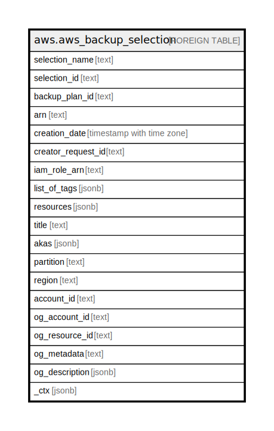

# aws.aws_backup_selection

## Description

AWS Backup Selection

## Columns

| Name | Type | Default | Nullable | Children | Parents | Comment |
| ---- | ---- | ------- | -------- | -------- | ------- | ------- |
| selection_name | text |  | true |  |  | The display name of a resource selection document. |
| selection_id | text |  | true |  |  | Uniquely identifies a request to assign a set of resources to a backup plan. |
| backup_plan_id | text |  | true |  |  | An ID that uniquely identifies a backup plan. |
| arn | text |  | true |  |  | The Amazon Resource Name (ARN) specifying the backup selection. |
| creation_date | timestamp with time zone |  | true |  |  | The date and time a resource backup plan is created. |
| creator_request_id | text |  | true |  |  | An unique string that identifies the request and allows failed requests to be retried without the risk of running the operation twice. |
| iam_role_arn | text |  | true |  |  | Specifies the IAM role Amazon Resource Name (ARN) to create the target recovery point. |
| list_of_tags | jsonb |  | true |  |  | An array of conditions used to specify a set of resources to assign to a backup plan. |
| resources | jsonb |  | true |  |  | Contains a list of BackupOptions for a resource type. |
| title | text |  | true |  |  | Title of the resource. |
| akas | jsonb |  | true |  |  | Array of globally unique identifier strings (also known as) for the resource. |
| partition | text |  | true |  |  | The AWS partition in which the resource is located (aws, aws-cn, or aws-us-gov). |
| region | text |  | true |  |  | The AWS Region in which the resource is located. |
| account_id | text |  | true |  |  | The AWS Account ID in which the resource is located. |
| og_account_id | text |  | true |  |  | The Platform Account ID in which the resource is located. |
| og_resource_id | text |  | true |  |  | The unique ID of the resource in opengovernance. |
| og_metadata | text |  | true |  |  | Platform Metadata of the AWS resource. |
| og_description | jsonb |  | true |  |  | The full model description of the resource |
| _ctx | jsonb |  | true |  |  | Steampipe context in JSON form, e.g. connection_name. |

## Relations

---

> Generated by [tbls](https://github.com/k1LoW/tbls)
