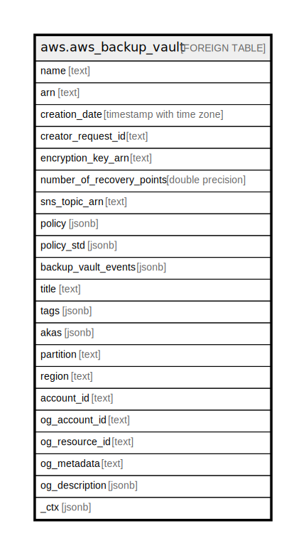

# aws.aws_backup_vault

## Description

AWS Backup Vault

## Columns

| Name | Type | Default | Nullable | Children | Parents | Comment |
| ---- | ---- | ------- | -------- | -------- | ------- | ------- |
| name | text |  | true |  |  | The name of a logical container where backups are stored. |
| arn | text |  | true |  |  | An Amazon Resource Name (ARN) that uniquely identifies a backup vault. |
| creation_date | timestamp with time zone |  | true |  |  | The date and time a resource backup is created. |
| creator_request_id | text |  | true |  |  | An unique string that identifies the request and allows failed requests to be retried without the risk of running the operation twice. |
| encryption_key_arn | text |  | true |  |  | The server-side encryption key that is used to protect your backups. |
| number_of_recovery_points | double precision |  | true |  |  | The number of recovery points that are stored in a backup vault. |
| sns_topic_arn | text |  | true |  |  | An ARN that uniquely identifies an Amazon Simple Notification Service. |
| policy | jsonb |  | true |  |  | The backup vault access policy document in JSON format. |
| policy_std | jsonb |  | true |  |  | Contains the backup vault access policy document in a canonical form for easier searching. |
| backup_vault_events | jsonb |  | true |  |  | An array of events that indicate the status of jobs to back up resources to the backup vault. |
| title | text |  | true |  |  | Title of the resource. |
| tags | jsonb |  | true |  |  | A map of tags for the resource. |
| akas | jsonb |  | true |  |  | Array of globally unique identifier strings (also known as) for the resource. |
| partition | text |  | true |  |  | The AWS partition in which the resource is located (aws, aws-cn, or aws-us-gov). |
| region | text |  | true |  |  | The AWS Region in which the resource is located. |
| account_id | text |  | true |  |  | The AWS Account ID in which the resource is located. |
| og_account_id | text |  | true |  |  | The Platform Account ID in which the resource is located. |
| og_resource_id | text |  | true |  |  | The unique ID of the resource in opengovernance. |
| og_metadata | text |  | true |  |  | Platform Metadata of the AWS resource. |
| og_description | jsonb |  | true |  |  | The full model description of the resource |
| _ctx | jsonb |  | true |  |  | Steampipe context in JSON form, e.g. connection_name. |

## Relations

---

> Generated by [tbls](https://github.com/k1LoW/tbls)
