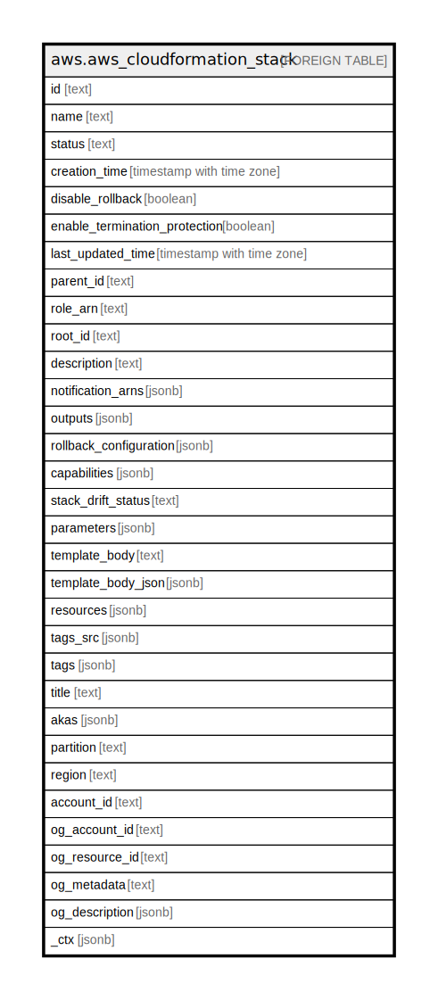

# aws.aws_cloudformation_stack

## Description

AWS CloudFormation Stack

## Columns

| Name | Type | Default | Nullable | Children | Parents | Comment |
| ---- | ---- | ------- | -------- | -------- | ------- | ------- |
| id | text |  | true |  |  | Unique identifier of the stack. |
| name | text |  | true |  |  | The name associated with the stack. |
| status | text |  | true |  |  | Current status of the stack. |
| creation_time | timestamp with time zone |  | true |  |  | The time at which the stack was created. |
| disable_rollback | boolean |  | true |  |  | Boolean to enable or disable rollback on stack creation failures. |
| enable_termination_protection | boolean |  | true |  |  | Specifies whether termination protection is enabled for the stack. |
| last_updated_time | timestamp with time zone |  | true |  |  | The time the stack was last updated. This field will only be returned if the stack has been updated at least once. |
| parent_id | text |  | true |  |  | ID of the direct parent of this stack. |
| role_arn | text |  | true |  |  | The Amazon Resource Name (ARN) of an AWS Identity and Access Management (IAM) role that is associated with the stack. |
| root_id | text |  | true |  |  | ID of the top-level stack to which the nested stack ultimately belongs. |
| description | text |  | true |  |  | A user-defined description associated with the stack. |
| notification_arns | jsonb |  | true |  |  | SNS topic ARNs to which stack related events are published. |
| outputs | jsonb |  | true |  |  | A list of output structures. |
| rollback_configuration | jsonb |  | true |  |  | The rollback triggers for AWS CloudFormation to monitor during stack creation and updating operations, and for the specified monitoring period afterwards. |
| capabilities | jsonb |  | true |  |  | The capabilities allowed in the stack. |
| stack_drift_status | text |  | true |  |  | Status of the stack's actual configuration compared to its expected template configuration. |
| parameters | jsonb |  | true |  |  | A list of Parameter structures. |
| template_body | text |  | true |  |  | Structure containing the template body. |
| template_body_json | jsonb |  | true |  |  | Structure containing the template body. Parsed into json object for better readability. |
| resources | jsonb |  | true |  |  | A list of Stack resource structures. |
| tags_src | jsonb |  | true |  |  | A list of tags associated with stack. |
| tags | jsonb |  | true |  |  | A map of tags for the resource. |
| title | text |  | true |  |  | Title of the resource. |
| akas | jsonb |  | true |  |  | Array of globally unique identifier strings (also known as) for the resource. |
| partition | text |  | true |  |  | The AWS partition in which the resource is located (aws, aws-cn, or aws-us-gov). |
| region | text |  | true |  |  | The AWS Region in which the resource is located. |
| account_id | text |  | true |  |  | The AWS Account ID in which the resource is located. |
| og_account_id | text |  | true |  |  | The Platform Account ID in which the resource is located. |
| og_resource_id | text |  | true |  |  | The unique ID of the resource in opengovernance. |
| og_metadata | text |  | true |  |  | Platform Metadata of the AWS resource. |
| og_description | jsonb |  | true |  |  | The full model description of the resource |
| _ctx | jsonb |  | true |  |  | Steampipe context in JSON form, e.g. connection_name. |

## Relations

---

> Generated by [tbls](https://github.com/k1LoW/tbls)
