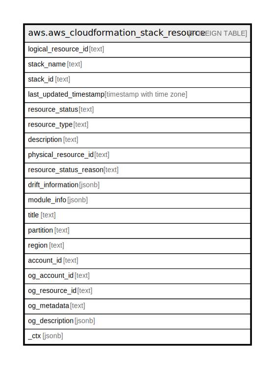

# aws.aws_cloudformation_stack_resource

## Description

AWS CloudFormation Stack Resource

## Columns

| Name | Type | Default | Nullable | Children | Parents | Comment |
| ---- | ---- | ------- | -------- | -------- | ------- | ------- |
| logical_resource_id | text |  | true |  |  | The logical name of the resource specified in the template. |
| stack_name | text |  | true |  |  | The name associated with the stack. |
| stack_id | text |  | true |  |  | Unique identifier of the stack. |
| last_updated_timestamp | timestamp with time zone |  | true |  |  | Time the status was updated. |
| resource_status | text |  | true |  |  | Current status of the resource. |
| resource_type | text |  | true |  |  | Type of resource. |
| description | text |  | true |  |  | User defined description associated with the resource. |
| physical_resource_id | text |  | true |  |  | The name or unique identifier that corresponds to a physical instance ID of a resource supported by CloudFormation. |
| resource_status_reason | text |  | true |  |  | Success/failure message associated with the resource. |
| drift_information | jsonb |  | true |  |  | Information about whether the resource's actual configuration differs, or has drifted, from its expected configuration, as defined in the stack template and any values specified as template parameters. For more information, see Detecting Unregulated Configuration Changes to Stacks and Resources. |
| module_info | jsonb |  | true |  |  | Contains information about the module from which the resource was created, if the resource was created from a module included in the stack template. |
| title | text |  | true |  |  | Title of the resource. |
| partition | text |  | true |  |  | The AWS partition in which the resource is located (aws, aws-cn, or aws-us-gov). |
| region | text |  | true |  |  | The AWS Region in which the resource is located. |
| account_id | text |  | true |  |  | The AWS Account ID in which the resource is located. |
| og_account_id | text |  | true |  |  | The Platform Account ID in which the resource is located. |
| og_resource_id | text |  | true |  |  | The unique ID of the resource in opengovernance. |
| og_metadata | text |  | true |  |  | Platform Metadata of the AWS resource. |
| og_description | jsonb |  | true |  |  | The full model description of the resource |
| _ctx | jsonb |  | true |  |  | Steampipe context in JSON form, e.g. connection_name. |

## Relations

---

> Generated by [tbls](https://github.com/k1LoW/tbls)
