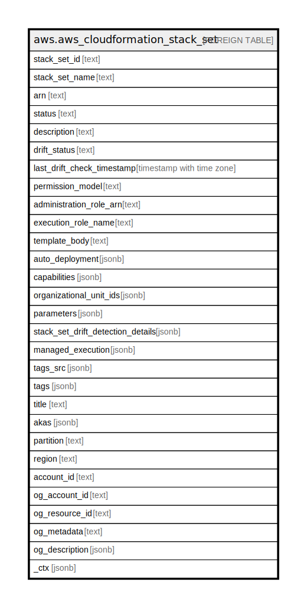

# aws.aws_cloudformation_stack_set

## Description

AWS CloudFormation StackSet

## Columns

| Name | Type | Default | Nullable | Children | Parents | Comment |
| ---- | ---- | ------- | -------- | -------- | ------- | ------- |
| stack_set_id | text |  | true |  |  | The ID of the stack set. |
| stack_set_name | text |  | true |  |  | The name of the stack set. |
| arn | text |  | true |  |  | The Amazon Resource Name (ARN) of the stack set |
| status | text |  | true |  |  | The status of the stack set. |
| description | text |  | true |  |  | A description of the stack set that you specify when the stack set is created or updated. |
| drift_status | text |  | true |  |  | Status of the stack set's actual configuration compared to its expected template and parameter configuration. A stack set is considered to have drifted if one or more of its stack instances have drifted from their expected template and parameter configuration. |
| last_drift_check_timestamp | timestamp with time zone |  | true |  |  | Most recent time when CloudFormation performed a drift detection operation on the stack set. |
| permission_model | text |  | true |  |  | Describes how the IAM roles required for stack set operations are created. |
| administration_role_arn | text |  | true |  |  | The Amazon Resource Name (ARN) of the IAM role used to create or update the stack set. |
| execution_role_name | text |  | true |  |  | The name of the IAM execution role used to create or update the stack set. |
| template_body | text |  | true |  |  | The structure that contains the body of the template that was used to create or update the stack set. |
| auto_deployment | jsonb |  | true |  |  | Describes whether StackSets automatically deploys to Organizations accounts that are added to a target organizational unit (OU). |
| capabilities | jsonb |  | true |  |  | The capabilities that are allowed in the stack set. |
| organizational_unit_ids | jsonb |  | true |  |  | The organization root ID or organizational unit (OU) IDs that you specified for DeploymentTargets. |
| parameters | jsonb |  | true |  |  | A list of input parameters for a stack set. |
| stack_set_drift_detection_details | jsonb |  | true |  |  | Detailed information about the drift status of the stack set. |
| managed_execution | jsonb |  | true |  |  | Describes whether StackSets performs non-conflicting operations concurrently and queues conflicting operations. |
| tags_src | jsonb |  | true |  |  | A list of tags associated with stack. |
| tags | jsonb |  | true |  |  | A map of tags for the resource. |
| title | text |  | true |  |  | Title of the resource. |
| akas | jsonb |  | true |  |  | Array of globally unique identifier strings (also known as) for the resource. |
| partition | text |  | true |  |  | The AWS partition in which the resource is located (aws, aws-cn, or aws-us-gov). |
| region | text |  | true |  |  | The AWS Region in which the resource is located. |
| account_id | text |  | true |  |  | The AWS Account ID in which the resource is located. |
| og_account_id | text |  | true |  |  | The Platform Account ID in which the resource is located. |
| og_resource_id | text |  | true |  |  | The unique ID of the resource in opengovernance. |
| og_metadata | text |  | true |  |  | Platform Metadata of the AWS resource. |
| og_description | jsonb |  | true |  |  | The full model description of the resource |
| _ctx | jsonb |  | true |  |  | Steampipe context in JSON form, e.g. connection_name. |

## Relations

---

> Generated by [tbls](https://github.com/k1LoW/tbls)
