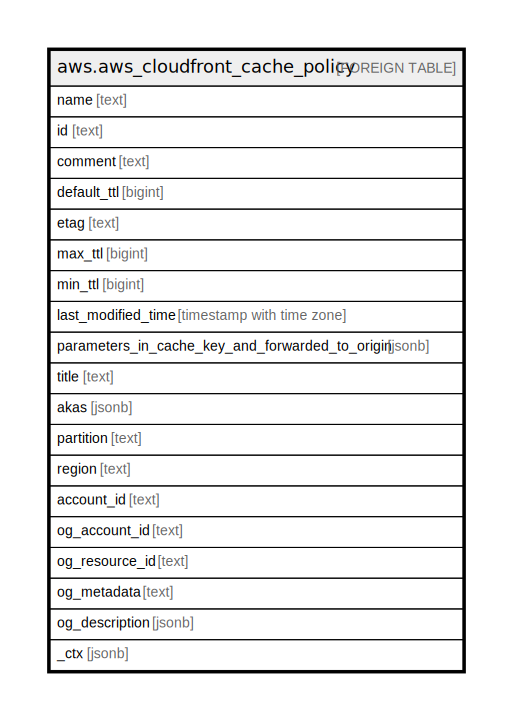

# aws.aws_cloudfront_cache_policy

## Description

AWS CloudFront Cache Policy

## Columns

| Name | Type | Default | Nullable | Children | Parents | Comment |
| ---- | ---- | ------- | -------- | -------- | ------- | ------- |
| name | text |  | true |  |  | A unique name to identify the cache policy. |
| id | text |  | true |  |  | The unique identifier for the cache policy. |
| comment | text |  | true |  |  | A comment to describe the cache policy. |
| default_ttl | bigint |  | true |  |  | The default amount of time, in seconds, that you want objects to stay in the CloudFront cache before CloudFront sends another request to the origin to see if the object has been updated. |
| etag | text |  | true |  |  | The current version of the cache policy. |
| max_ttl | bigint |  | true |  |  | The maximum amount of time, in seconds, that you want objects to stay in the CloudFront cache before CloudFront sends another request to the origin to see if the object has been updated. |
| min_ttl | bigint |  | true |  |  | The minimum amount of time, in seconds, that you want objects to stay in the CloudFront cache before CloudFront sends another request to the origin to see if the object has been updated. |
| last_modified_time | timestamp with time zone |  | true |  |  | The date and time when the cache policy was last modified. |
| parameters_in_cache_key_and_forwarded_to_origin | jsonb |  | true |  |  | The HTTP headers, cookies, and URL query strings to include in the cache key. The values included in the cache key are automatically included in requests that CloudFront sends to the origin. |
| title | text |  | true |  |  | Title of the resource. |
| akas | jsonb |  | true |  |  | Array of globally unique identifier strings (also known as) for the resource. |
| partition | text |  | true |  |  | The AWS partition in which the resource is located (aws, aws-cn, or aws-us-gov). |
| region | text |  | true |  |  | The AWS Region in which the resource is located. |
| account_id | text |  | true |  |  | The AWS Account ID in which the resource is located. |
| og_account_id | text |  | true |  |  | The Platform Account ID in which the resource is located. |
| og_resource_id | text |  | true |  |  | The unique ID of the resource in opengovernance. |
| og_metadata | text |  | true |  |  | Platform Metadata of the AWS resource. |
| og_description | jsonb |  | true |  |  | The full model description of the resource |
| _ctx | jsonb |  | true |  |  | Steampipe context in JSON form, e.g. connection_name. |

## Relations

---

> Generated by [tbls](https://github.com/k1LoW/tbls)
