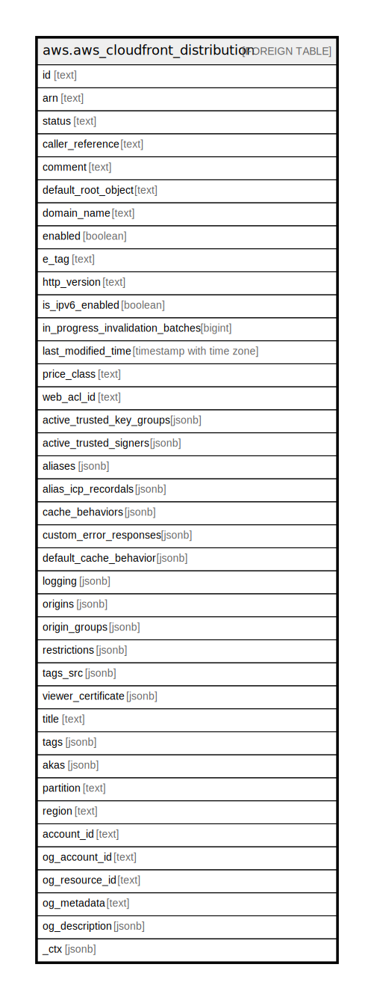

# aws.aws_cloudfront_distribution

## Description

AWS CloudFront Distribution

## Columns

| Name | Type | Default | Nullable | Children | Parents | Comment |
| ---- | ---- | ------- | -------- | -------- | ------- | ------- |
| id | text |  | true |  |  | The identifier for the Distribution. |
| arn | text |  | true |  |  | The ARN (Amazon Resource Name) for the distribution. |
| status | text |  | true |  |  | The current status of the Distribution. |
| caller_reference | text |  | true |  |  | A unique value that ensures that the request can't be replayed. |
| comment | text |  | true |  |  | The comment originally specified when this Distribution was created. |
| default_root_object | text |  | true |  |  | The object that you want CloudFront to request from your origin. |
| domain_name | text |  | true |  |  | The domain name that corresponds to the Distribution. |
| enabled | boolean |  | true |  |  | Whether the Distribution is enabled to accept user requests for content. |
| e_tag | text |  | true |  |  | The current version of the configuration. |
| http_version | text |  | true |  |  | Specify the maximum HTTP version that you want viewers to use to communicate with CloudFront. The default value for new web Distributions is http2. Viewers that don't support HTTP/2 will automatically use an earlier version. |
| is_ipv6_enabled | boolean |  | true |  |  | Whether CloudFront responds to IPv6 DNS requests with an IPv6 address for your Distribution. |
| in_progress_invalidation_batches | bigint |  | true |  |  | The number of invalidation batches currently in progress. |
| last_modified_time | timestamp with time zone |  | true |  |  | The date and time the Distribution was last modified. |
| price_class | text |  | true |  |  | A complex type that contains information about price class for this streaming Distribution. |
| web_acl_id | text |  | true |  |  | The Web ACL Id (if any) associated with the distribution. |
| active_trusted_key_groups | jsonb |  | true |  |  | CloudFront automatically adds this field to the response if you’ve configured a cache behavior in this distribution to serve private content using key groups. |
| active_trusted_signers | jsonb |  | true |  |  | A list of AWS accounts and the identifiers of active CloudFront key pairs in each account that CloudFront can use to verify the signatures of signed URLs and signed cookies. |
| aliases | jsonb |  | true |  |  | A complex type that contains information about CNAMEs (alternate domain names),if any, for this distribution. |
| alias_icp_recordals | jsonb |  | true |  |  | AWS services in China customers must file for an Internet Content Provider (ICP) recordal if they want to serve content publicly on an alternate domain name, also known as a CNAME, that they've added to CloudFront. AliasICPRecordal provides the ICP recordal status for CNAMEs associated with distributions. |
| cache_behaviors | jsonb |  | true |  |  | The number of cache behaviors for this Distribution. |
| custom_error_responses | jsonb |  | true |  |  | A complex type that contains zero or more CustomErrorResponses elements. |
| default_cache_behavior | jsonb |  | true |  |  | A complex type that describes the default cache behavior if you don't specify a CacheBehavior element or if files don't match any of the values of PathPattern in CacheBehavior elements. You must create exactly one default cache behavior. |
| logging | jsonb |  | true |  |  | A complex type that controls whether access logs are written for the distribution. |
| origins | jsonb |  | true |  |  | A complex type that contains information about origins for this distribution. |
| origin_groups | jsonb |  | true |  |  | A complex type that contains information about origin groups for this distribution. |
| restrictions | jsonb |  | true |  |  | A complex type that identifies ways in which you want to restrict distribution of your content. |
| tags_src | jsonb |  | true |  |  | A list of tags assigned to the Maintenance Window |
| viewer_certificate | jsonb |  | true |  |  | A complex type that determines the distribution's SSL/TLS configuration for communicating with viewers. |
| title | text |  | true |  |  | Title of the resource. |
| tags | jsonb |  | true |  |  | A map of tags for the resource. |
| akas | jsonb |  | true |  |  | Array of globally unique identifier strings (also known as) for the resource. |
| partition | text |  | true |  |  | The AWS partition in which the resource is located (aws, aws-cn, or aws-us-gov). |
| region | text |  | true |  |  | The AWS Region in which the resource is located. |
| account_id | text |  | true |  |  | The AWS Account ID in which the resource is located. |
| og_account_id | text |  | true |  |  | The Platform Account ID in which the resource is located. |
| og_resource_id | text |  | true |  |  | The unique ID of the resource in opengovernance. |
| og_metadata | text |  | true |  |  | Platform Metadata of the AWS resource. |
| og_description | jsonb |  | true |  |  | The full model description of the resource |
| _ctx | jsonb |  | true |  |  | Steampipe context in JSON form, e.g. connection_name. |

## Relations

---

> Generated by [tbls](https://github.com/k1LoW/tbls)
