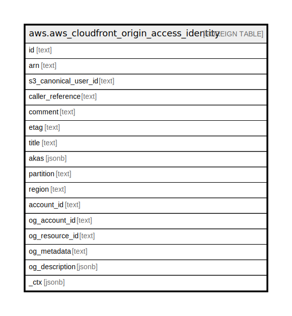

# aws.aws_cloudfront_origin_access_identity

## Description

AWS CloudFront Origin Access Identity

## Columns

| Name | Type | Default | Nullable | Children | Parents | Comment |
| ---- | ---- | ------- | -------- | -------- | ------- | ------- |
| id | text |  | true |  |  | The ID for the origin access identity. |
| arn | text |  | true |  |  | The Amazon Resource Name (ARN) specifying the origin access identity. |
| s3_canonical_user_id | text |  | true |  |  | The Amazon S3 canonical user ID for the origin access identity, which you use when giving the origin access identity read permission to an object in Amazon S3. |
| caller_reference | text |  | true |  |  | A unique value that ensures that the request can't be replayed. |
| comment | text |  | true |  |  | The comment for this origin access identity. |
| etag | text |  | true |  |  | The current version of the origin access identity's information. |
| title | text |  | true |  |  | Title of the resource. |
| akas | jsonb |  | true |  |  | Array of globally unique identifier strings (also known as) for the resource. |
| partition | text |  | true |  |  | The AWS partition in which the resource is located (aws, aws-cn, or aws-us-gov). |
| region | text |  | true |  |  | The AWS Region in which the resource is located. |
| account_id | text |  | true |  |  | The AWS Account ID in which the resource is located. |
| og_account_id | text |  | true |  |  | The Platform Account ID in which the resource is located. |
| og_resource_id | text |  | true |  |  | The unique ID of the resource in opengovernance. |
| og_metadata | text |  | true |  |  | Platform Metadata of the AWS resource. |
| og_description | jsonb |  | true |  |  | The full model description of the resource |
| _ctx | jsonb |  | true |  |  | Steampipe context in JSON form, e.g. connection_name. |

## Relations

---

> Generated by [tbls](https://github.com/k1LoW/tbls)
