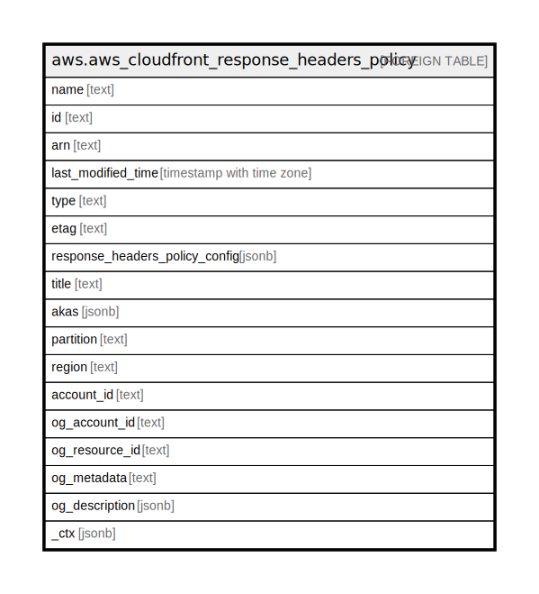

# aws.aws_cloudfront_response_headers_policy

## Description

AWS Cloudfront Response Headers Policy

## Columns

| Name | Type | Default | Nullable | Children | Parents | Comment |
| ---- | ---- | ------- | -------- | -------- | ------- | ------- |
| name | text |  | true |  |  | The name of the response headers policy. |
| id | text |  | true |  |  | The identifier for the response headers policy. |
| arn | text |  | true |  |  | The version identifier for the current version of the response headers policy. |
| last_modified_time | timestamp with time zone |  | true |  |  | The date and time when the response headers policy was last modified. |
| type | text |  | true |  |  | The type of response headers policy, either managed (created by AWS) or custom (created in this AWS account). |
| etag | text |  | true |  |  | The version identifier for the current version of the response headers policy. |
| response_headers_policy_config | jsonb |  | true |  |  | A response headers policy contains information about a set of HTTP response headers and their values. CloudFront adds the headers in the policy to HTTP responses that it sends for requests that match a cache behavior that’s associated with the policy. |
| title | text |  | true |  |  | Title of the resource. |
| akas | jsonb |  | true |  |  | Array of globally unique identifier strings (also known as) for the resource. |
| partition | text |  | true |  |  | The AWS partition in which the resource is located (aws, aws-cn, or aws-us-gov). |
| region | text |  | true |  |  | The AWS Region in which the resource is located. |
| account_id | text |  | true |  |  | The AWS Account ID in which the resource is located. |
| og_account_id | text |  | true |  |  | The Platform Account ID in which the resource is located. |
| og_resource_id | text |  | true |  |  | The unique ID of the resource in opengovernance. |
| og_metadata | text |  | true |  |  | Platform Metadata of the AWS resource. |
| og_description | jsonb |  | true |  |  | The full model description of the resource |
| _ctx | jsonb |  | true |  |  | Steampipe context in JSON form, e.g. connection_name. |

## Relations

---

> Generated by [tbls](https://github.com/k1LoW/tbls)
