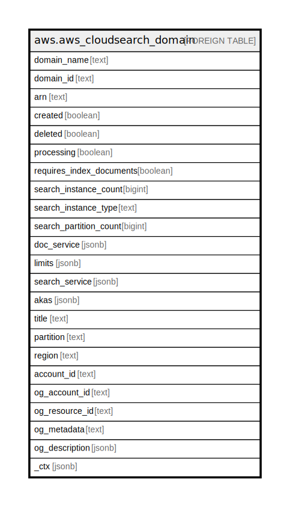

# aws.aws_cloudsearch_domain

## Description

AWS CloudSearch Domain

## Columns

| Name | Type | Default | Nullable | Children | Parents | Comment |
| ---- | ---- | ------- | -------- | -------- | ------- | ------- |
| domain_name | text |  | true |  |  | A string that represents the name of a domain. |
| domain_id | text |  | true |  |  | An internally generated unique identifier for a domain. |
| arn | text |  | true |  |  | The Amazon Resource Name (ARN) of the search domain. |
| created | boolean |  | true |  |  | True if the search domain is created. |
| deleted | boolean |  | true |  |  | True if the search domain has been deleted. |
| processing | boolean |  | true |  |  | True if processing is being done to activate the current domain configuration. |
| requires_index_documents | boolean |  | true |  |  | True if Index Documents need to be called to activate the current domain configuration. |
| search_instance_count | bigint |  | true |  |  | The number of search instances that are available to process search requests. |
| search_instance_type | text |  | true |  |  | The instance type that is being used to process search requests. |
| search_partition_count | bigint |  | true |  |  | The number of partitions across which the search index is spread. |
| doc_service | jsonb |  | true |  |  | The service endpoint for updating documents in a search domain. |
| limits | jsonb |  | true |  |  | Limit details for a search domain. |
| search_service | jsonb |  | true |  |  | The service endpoint for requesting search results from a search domain. |
| akas | jsonb |  | true |  |  | Array of globally unique identifier strings (also known as) for the resource. |
| title | text |  | true |  |  | Title of the resource. |
| partition | text |  | true |  |  | The AWS partition in which the resource is located (aws, aws-cn, or aws-us-gov). |
| region | text |  | true |  |  | The AWS Region in which the resource is located. |
| account_id | text |  | true |  |  | The AWS Account ID in which the resource is located. |
| og_account_id | text |  | true |  |  | The Platform Account ID in which the resource is located. |
| og_resource_id | text |  | true |  |  | The unique ID of the resource in opengovernance. |
| og_metadata | text |  | true |  |  | Platform Metadata of the AWS resource. |
| og_description | jsonb |  | true |  |  | The full model description of the resource |
| _ctx | jsonb |  | true |  |  | Steampipe context in JSON form, e.g. connection_name. |

## Relations

---

> Generated by [tbls](https://github.com/k1LoW/tbls)
