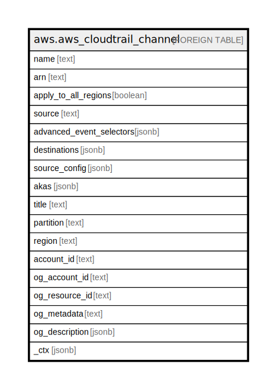

# aws.aws_cloudtrail_channel

## Description

AWS CloudTrail Channel

## Columns

| Name | Type | Default | Nullable | Children | Parents | Comment |
| ---- | ---- | ------- | -------- | -------- | ------- | ------- |
| name | text |  | true |  |  | The name of the cloudtrail channel. |
| arn | text |  | true |  |  | The Amazon Resource Name (ARN) of a channel. |
| apply_to_all_regions | boolean |  | true |  |  | Specifies whether the channel applies to a single region or to all regions. |
| source | text |  | true |  |  | The event source for the cloudtrail channel. |
| advanced_event_selectors | jsonb |  | true |  |  | The advanced event selectors that are configured for the channel. |
| destinations | jsonb |  | true |  |  | The Amazon Web Services service that created the service-linked channel. |
| source_config | jsonb |  | true |  |  | Configuration information about the channel. |
| akas | jsonb |  | true |  |  | Array of globally unique identifier strings (also known as) for the resource. |
| title | text |  | true |  |  | Title of the resource. |
| partition | text |  | true |  |  | The AWS partition in which the resource is located (aws, aws-cn, or aws-us-gov). |
| region | text |  | true |  |  | The AWS Region in which the resource is located. |
| account_id | text |  | true |  |  | The AWS Account ID in which the resource is located. |
| og_account_id | text |  | true |  |  | The Platform Account ID in which the resource is located. |
| og_resource_id | text |  | true |  |  | The unique ID of the resource in opengovernance. |
| og_metadata | text |  | true |  |  | Platform Metadata of the AWS resource. |
| og_description | jsonb |  | true |  |  | The full model description of the resource |
| _ctx | jsonb |  | true |  |  | Steampipe context in JSON form, e.g. connection_name. |

## Relations

---

> Generated by [tbls](https://github.com/k1LoW/tbls)
