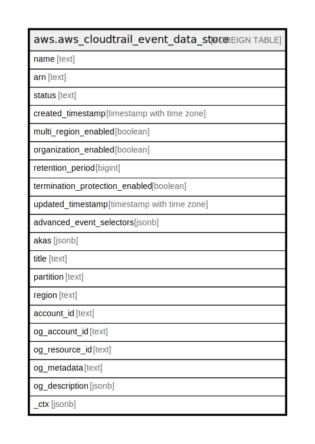

# aws.aws_cloudtrail_event_data_store

## Description

AWS CloudTrail Event Data Store

## Columns

| Name | Type | Default | Nullable | Children | Parents | Comment |
| ---- | ---- | ------- | -------- | -------- | ------- | ------- |
| name | text |  | true |  |  | The name of the event data store. |
| arn | text |  | true |  |  | The Amazon Resource Name (ARN) of the event data store. |
| status | text |  | true |  |  | The status of an event data store. |
| created_timestamp | timestamp with time zone |  | true |  |  | The timestamp of the event data store's creation. |
| multi_region_enabled | boolean |  | true |  |  | Indicates whether the event data store includes events from all regions, or only from the region in which it was created. |
| organization_enabled | boolean |  | true |  |  | Indicates that an event data store is collecting logged events for an organization. |
| retention_period | bigint |  | true |  |  | The retention period, in days. |
| termination_protection_enabled | boolean |  | true |  |  | Indicates whether the event data store is protected from termination. |
| updated_timestamp | timestamp with time zone |  | true |  |  | The timestamp showing when an event data store was updated, if applicable. UpdatedTimestamp is always either the same or newer than the time shown in CreatedTimestamp. |
| advanced_event_selectors | jsonb |  | true |  |  | The advanced event selectors that were used to select events for the data store. |
| akas | jsonb |  | true |  |  | Array of globally unique identifier strings (also known as) for the resource. |
| title | text |  | true |  |  | Title of the resource. |
| partition | text |  | true |  |  | The AWS partition in which the resource is located (aws, aws-cn, or aws-us-gov). |
| region | text |  | true |  |  | The AWS Region in which the resource is located. |
| account_id | text |  | true |  |  | The AWS Account ID in which the resource is located. |
| og_account_id | text |  | true |  |  | The Platform Account ID in which the resource is located. |
| og_resource_id | text |  | true |  |  | The unique ID of the resource in opengovernance. |
| og_metadata | text |  | true |  |  | Platform Metadata of the AWS resource. |
| og_description | jsonb |  | true |  |  | The full model description of the resource |
| _ctx | jsonb |  | true |  |  | Steampipe context in JSON form, e.g. connection_name. |

## Relations

---

> Generated by [tbls](https://github.com/k1LoW/tbls)
