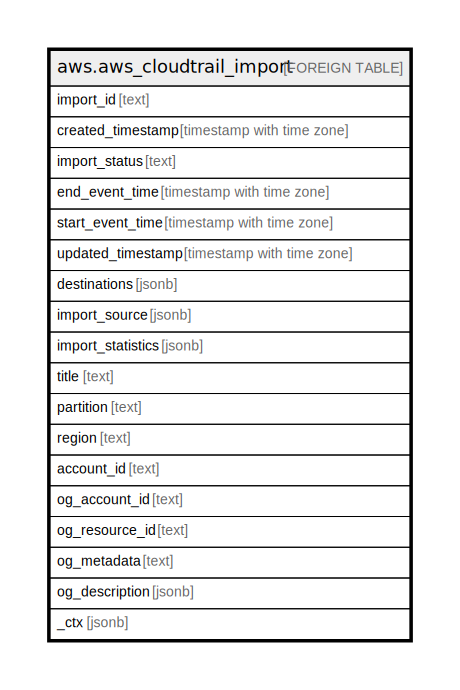

# aws.aws_cloudtrail_import

## Description

AWS CloudTrail Import

## Columns

| Name | Type | Default | Nullable | Children | Parents | Comment |
| ---- | ---- | ------- | -------- | -------- | ------- | ------- |
| import_id | text |  | true |  |  | The ID of the import. |
| created_timestamp | timestamp with time zone |  | true |  |  | The timestamp of the import's creation. |
| import_status | text |  | true |  |  | The status of the import. |
| end_event_time | timestamp with time zone |  | true |  |  | Used with EndEventTime to bound a StartImport request, and limit imported trail events to only those events logged within a specified time period. |
| start_event_time | timestamp with time zone |  | true |  |  | Used with StartEventTime to bound a StartImport request, and limit imported trail events to only those events logged within a specified time period. |
| updated_timestamp | timestamp with time zone |  | true |  |  | The timestamp of the import's last update. |
| destinations | jsonb |  | true |  |  | The ARN of the destination event data store. |
| import_source | jsonb |  | true |  |  | The source S3 bucket. |
| import_statistics | jsonb |  | true |  |  | Provides statistics for the import. |
| title | text |  | true |  |  | Title of the resource. |
| partition | text |  | true |  |  | The AWS partition in which the resource is located (aws, aws-cn, or aws-us-gov). |
| region | text |  | true |  |  | The AWS Region in which the resource is located. |
| account_id | text |  | true |  |  | The AWS Account ID in which the resource is located. |
| og_account_id | text |  | true |  |  | The Platform Account ID in which the resource is located. |
| og_resource_id | text |  | true |  |  | The unique ID of the resource in opengovernance. |
| og_metadata | text |  | true |  |  | Platform Metadata of the AWS resource. |
| og_description | jsonb |  | true |  |  | The full model description of the resource |
| _ctx | jsonb |  | true |  |  | Steampipe context in JSON form, e.g. connection_name. |

## Relations

---

> Generated by [tbls](https://github.com/k1LoW/tbls)
