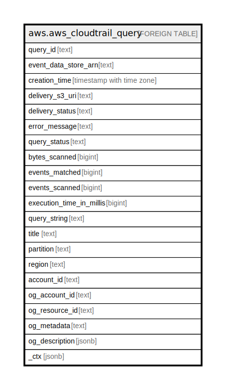

# aws.aws_cloudtrail_query

## Description

AWS CloudTrail Query

## Columns

| Name | Type | Default | Nullable | Children | Parents | Comment |
| ---- | ---- | ------- | -------- | -------- | ------- | ------- |
| query_id | text |  | true |  |  | The ID of the query. |
| event_data_store_arn | text |  | true |  |  | The ID of the event data store. |
| creation_time | timestamp with time zone |  | true |  |  | The creation time of the query. |
| delivery_s3_uri | text |  | true |  |  | The URI for the S3 bucket where CloudTrail delivered query results, if applicable. |
| delivery_status | text |  | true |  |  | The delivery status. |
| error_message | text |  | true |  |  | The error message returned if a query failed. |
| query_status | text |  | true |  |  | The status of a query. Values for QueryStatus include QUEUED, RUNNING, FINISHED, FAILED, TIMED_OUT, or CANCELLED. |
| bytes_scanned | bigint |  | true |  |  | Gets metadata about a query, including the number of events that were matched, the total number of events scanned, the query run time in milliseconds, and the query's creation time. |
| events_matched | bigint |  | true |  |  | The number of events that matched a query. |
| events_scanned | bigint |  | true |  |  | The number of events that the query scanned in the event data store. |
| execution_time_in_millis | bigint |  | true |  |  | The query's run time, in milliseconds. |
| query_string | text |  | true |  |  | The SQL code of a query. |
| title | text |  | true |  |  | Title of the resource. |
| partition | text |  | true |  |  | The AWS partition in which the resource is located (aws, aws-cn, or aws-us-gov). |
| region | text |  | true |  |  | The AWS Region in which the resource is located. |
| account_id | text |  | true |  |  | The AWS Account ID in which the resource is located. |
| og_account_id | text |  | true |  |  | The Platform Account ID in which the resource is located. |
| og_resource_id | text |  | true |  |  | The unique ID of the resource in opengovernance. |
| og_metadata | text |  | true |  |  | Platform Metadata of the AWS resource. |
| og_description | jsonb |  | true |  |  | The full model description of the resource |
| _ctx | jsonb |  | true |  |  | Steampipe context in JSON form, e.g. connection_name. |

## Relations

---

> Generated by [tbls](https://github.com/k1LoW/tbls)
