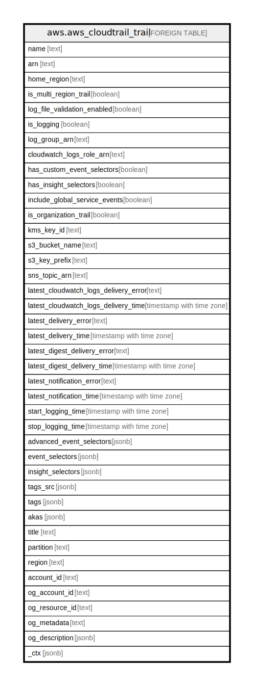

# aws.aws_cloudtrail_trail

## Description

AWS CloudTrail Trail

## Columns

| Name | Type | Default | Nullable | Children | Parents | Comment |
| ---- | ---- | ------- | -------- | -------- | ------- | ------- |
| name | text |  | true |  |  | The name of the trail. |
| arn | text |  | true |  |  | The Amazon Resource Name (ARN) of the trail. |
| home_region | text |  | true |  |  | The region in which the trail was created. |
| is_multi_region_trail | boolean |  | true |  |  | Specifies whether the trail exists only in one region or exists in all regions. |
| log_file_validation_enabled | boolean |  | true |  |  | Specifies whether log file validation is enabled, or not. |
| is_logging | boolean |  | true |  |  | Specifies whether the CloudTrail is currently logging AWS API calls, or not. |
| log_group_arn | text |  | true |  |  | Specifies an Amazon Resource Name (ARN), a unique identifier that represents the log group to which CloudTrail logs will be delivered. |
| cloudwatch_logs_role_arn | text |  | true |  |  | Specifies the role for the CloudWatch Logs endpoint to assume to write to a user's log group. |
| has_custom_event_selectors | boolean |  | true |  |  | Specifies whether the trail has custom event selectors, or not. |
| has_insight_selectors | boolean |  | true |  |  | Specifies whether a trail has insight types specified in an InsightSelector list, or not. |
| include_global_service_events | boolean |  | true |  |  | Specifies whether to include AWS API calls from AWS global services, or not. |
| is_organization_trail | boolean |  | true |  |  | Specifies whether the trail is an organization trail, or not. |
| kms_key_id | text |  | true |  |  | Specifies the KMS key ID that encrypts the logs delivered by CloudTrail. |
| s3_bucket_name | text |  | true |  |  | Name of the Amazon S3 bucket into which CloudTrail delivers your trail files. |
| s3_key_prefix | text |  | true |  |  | Specifies the Amazon S3 key prefix that comes after the name of the bucket you have designated for log file delivery. |
| sns_topic_arn | text |  | true |  |  | Specifies the ARN of the Amazon SNS topic that CloudTrail uses to send notifications when log files are delivered. |
| latest_cloudwatch_logs_delivery_error | text |  | true |  |  | Displays any CloudWatch Logs error that CloudTrail encountered when attempting to deliver logs to CloudWatch Logs. |
| latest_cloudwatch_logs_delivery_time | timestamp with time zone |  | true |  |  | Displays the most recent date and time when CloudTrail delivered logs to CloudWatch Logs. |
| latest_delivery_error | text |  | true |  |  | Displays any Amazon S3 error that CloudTrail encountered when attempting to deliver log files to the designated bucket. |
| latest_delivery_time | timestamp with time zone |  | true |  |  | Specifies the date and time that CloudTrail last delivered log files to an account's Amazon S3 bucket. |
| latest_digest_delivery_error | text |  | true |  |  | Displays any Amazon S3 error that CloudTrail encountered when attempting to deliver a digest file to the designated bucket. |
| latest_digest_delivery_time | timestamp with time zone |  | true |  |  | Specifies the date and time that CloudTrail last delivered a digest file to an account's Amazon S3 bucket. |
| latest_notification_error | text |  | true |  |  | Displays any Amazon SNS error that CloudTrail encountered when attempting to send a notification. |
| latest_notification_time | timestamp with time zone |  | true |  |  | Specifies the date and time of the most recent Amazon SNS notification that CloudTrail has written a new log file to an account's Amazon S3 bucket. |
| start_logging_time | timestamp with time zone |  | true |  |  | Specifies the most recent date and time when CloudTrail started recording API calls for an AWS account. |
| stop_logging_time | timestamp with time zone |  | true |  |  | Specifies the most recent date and time when CloudTrail stopped recording API calls for an AWS account. |
| advanced_event_selectors | jsonb |  | true |  |  | Describes the advanced event selectors that are configured for the trail. |
| event_selectors | jsonb |  | true |  |  | Describes the event selectors that are configured for the trail. |
| insight_selectors | jsonb |  | true |  |  | A JSON string that contains the insight types you want to log on a trail. |
| tags_src | jsonb |  | true |  |  | A list of tags assigned to the trail. |
| tags | jsonb |  | true |  |  | A map of tags for the resource. |
| akas | jsonb |  | true |  |  | Array of globally unique identifier strings (also known as) for the resource. |
| title | text |  | true |  |  | Title of the resource. |
| partition | text |  | true |  |  | The AWS partition in which the resource is located (aws, aws-cn, or aws-us-gov). |
| region | text |  | true |  |  | The AWS Region in which the resource is located. |
| account_id | text |  | true |  |  | The AWS Account ID in which the resource is located. |
| og_account_id | text |  | true |  |  | The Platform Account ID in which the resource is located. |
| og_resource_id | text |  | true |  |  | The unique ID of the resource in opengovernance. |
| og_metadata | text |  | true |  |  | Platform Metadata of the AWS resource. |
| og_description | jsonb |  | true |  |  | The full model description of the resource |
| _ctx | jsonb |  | true |  |  | Steampipe context in JSON form, e.g. connection_name. |

## Relations

---

> Generated by [tbls](https://github.com/k1LoW/tbls)
