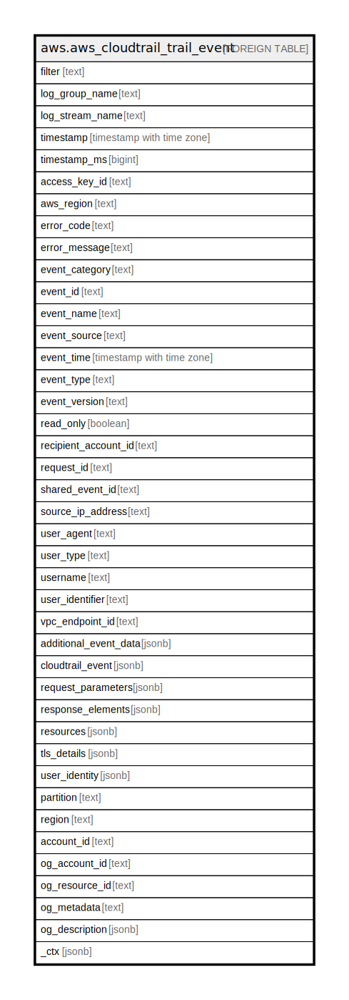

# aws.aws_cloudtrail_trail_event

## Description

CloudTrail events from cloudwatch service.

## Columns

| Name | Type | Default | Nullable | Children | Parents | Comment |
| ---- | ---- | ------- | -------- | -------- | ------- | ------- |
| filter | text |  | true |  |  | The cloudwatch filter pattern for the search. |
| log_group_name | text |  | true |  |  | The name of the log group to which this event belongs. |
| log_stream_name | text |  | true |  |  | The name of the log stream to which this event belongs. |
| timestamp | timestamp with time zone |  | true |  |  | The time when the event occurred. |
| timestamp_ms | bigint |  | true |  |  | The time when the event occurred. |
| access_key_id | text |  | true |  |  | The AWS access key ID that was used to sign the request. If the request was made with temporary security credentials, this is the access key ID of the temporary credentials. |
| aws_region | text |  | true |  |  | The AWS region that the request was made to, such as us-east-2. |
| error_code | text |  | true |  |  | The AWS service error if the request returns an error. |
| error_message | text |  | true |  |  | If the request returns an error, the description of the error. |
| event_category | text |  | true |  |  | Shows the event category that is used in LookupEvents calls. |
| event_id | text |  | true |  |  | The ID of the event. |
| event_name | text |  | true |  |  | The name of the event returned. |
| event_source | text |  | true |  |  | The AWS service that the request was made to. |
| event_time | timestamp with time zone |  | true |  |  | The date and time the request was made, in coordinated universal time (UTC). |
| event_type | text |  | true |  |  | Identifies the type of event that generated the event record. |
| event_version | text |  | true |  |  | The version of the log event format. |
| read_only | boolean |  | true |  |  | Information about whether the event is a write event or a read event. |
| recipient_account_id | text |  | true |  |  | Represents the account ID that received this event. |
| request_id | text |  | true |  |  | The value that identifies the request. |
| shared_event_id | text |  | true |  |  | GUID generated by CloudTrail to uniquely identify CloudTrail events from the same AWS action that is sent to different AWS accounts. |
| source_ip_address | text |  | true |  |  | The IP address that the request was made from. |
| user_agent | text |  | true |  |  | The agent through which the request was made, such as the AWS Management Console, an AWS service, the AWS SDKs or the AWS CLI. |
| user_type | text |  | true |  |  | The name of the event returned. |
| username | text |  | true |  |  | The user name of the user that made the api request. |
| user_identifier | text |  | true |  |  | The name/arn of user/role that made the api call. |
| vpc_endpoint_id | text |  | true |  |  | Identifies the VPC endpoint in which requests were made from a VPC to another AWS service, such as Amazon S3. |
| additional_event_data | jsonb |  | true |  |  | Additional data about the event that was not part of the request or response. |
| cloudtrail_event | jsonb |  | true |  |  | The CloudTrail event in the json format. |
| request_parameters | jsonb |  | true |  |  | The parameters, if any, that were sent with the request. |
| response_elements | jsonb |  | true |  |  | The response element for actions that make changes (create, update, or delete actions). |
| resources | jsonb |  | true |  |  | A list of resources referenced by the event returned. |
| tls_details | jsonb |  | true |  |  | Shows information about the Transport Layer Security (TLS) version, cipher suites, and the FQDN of the client-provided host name of a service API call. |
| user_identity | jsonb |  | true |  |  | Information about the user that made the request. |
| partition | text |  | true |  |  | The AWS partition in which the resource is located (aws, aws-cn, or aws-us-gov). |
| region | text |  | true |  |  | The AWS Region in which the resource is located. |
| account_id | text |  | true |  |  | The AWS Account ID in which the resource is located. |
| og_account_id | text |  | true |  |  | The Platform Account ID in which the resource is located. |
| og_resource_id | text |  | true |  |  | The unique ID of the resource in opengovernance. |
| og_metadata | text |  | true |  |  | Platform Metadata of the AWS resource. |
| og_description | jsonb |  | true |  |  | The full model description of the resource |
| _ctx | jsonb |  | true |  |  | Steampipe context in JSON form, e.g. connection_name. |

## Relations

---

> Generated by [tbls](https://github.com/k1LoW/tbls)
