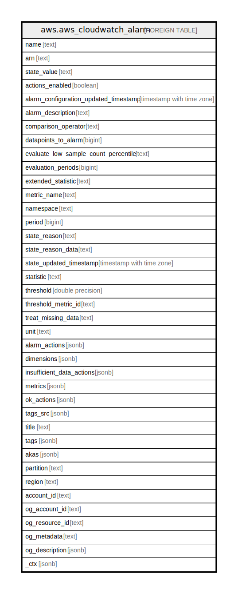

# aws.aws_cloudwatch_alarm

## Description

AWS CloudWatch Alarm

## Columns

| Name | Type | Default | Nullable | Children | Parents | Comment |
| ---- | ---- | ------- | -------- | -------- | ------- | ------- |
| name | text |  | true |  |  | The name of the alarm. |
| arn | text |  | true |  |  | The Amazon Resource Name (ARN) of the alarm. |
| state_value | text |  | true |  |  | The state value for the alarm. |
| actions_enabled | boolean |  | true |  |  | Indicates whether actions should be executed during any changes to the alarm state. |
| alarm_configuration_updated_timestamp | timestamp with time zone |  | true |  |  | The time stamp of the last update to the alarm configuration. |
| alarm_description | text |  | true |  |  | The description of the alarm. |
| comparison_operator | text |  | true |  |  | The arithmetic operation to use when comparing the specified statistic and threshold. The specified statistic value is used as the first operand. |
| datapoints_to_alarm | bigint |  | true |  |  | The number of data points that must be breaching to trigger the alarm. |
| evaluate_low_sample_count_percentile | text |  | true |  |  | Used only for alarms based on percentiles. |
| evaluation_periods | bigint |  | true |  |  | The number of periods over which data is compared to the specified threshold. |
| extended_statistic | text |  | true |  |  | The percentile statistic for the metric associated with the alarm. Specify a value between p0.0 and p100. |
| metric_name | text |  | true |  |  | The name of the metric associated with the alarm, if this is an alarm based on a single metric. |
| namespace | text |  | true |  |  | The namespace of the metric associated with the alarm. |
| period | bigint |  | true |  |  | The period, in seconds, over which the statistic is applied. |
| state_reason | text |  | true |  |  | An explanation for the alarm state, in text format. |
| state_reason_data | text |  | true |  |  | An explanation for the alarm state, in JSON format. |
| state_updated_timestamp | timestamp with time zone |  | true |  |  | The time stamp of the last update to the alarm state. |
| statistic | text |  | true |  |  | The statistic for the metric associated with the alarm, other than percentile. |
| threshold | double precision |  | true |  |  | The value to compare with the specified statistic. |
| threshold_metric_id | text |  | true |  |  | In an alarm based on an anomaly detection model, this is the ID of the ANOMALY_DETECTION_BAND function used as the threshold for the alarm. |
| treat_missing_data | text |  | true |  |  | Sets how this alarm is to handle missing data points. If this parameter is omitted, the default behavior of missing is used. |
| unit | text |  | true |  |  | The unit of the metric associated with the alarm. |
| alarm_actions | jsonb |  | true |  |  | The actions to execute when this alarm transitions to the ALARM state from any other state. Each action is specified as an Amazon Resource Name (ARN). |
| dimensions | jsonb |  | true |  |  | The dimensions for the metric associated with the alarm. |
| insufficient_data_actions | jsonb |  | true |  |  | The actions to execute when this alarm transitions to the INSUFFICIENT_DATA state from any other state. Each action is specified as an Amazon Resource Name (ARN). |
| metrics | jsonb |  | true |  |  | An array of MetricDataQuery structures, used in an alarm based on a metric math expression. |
| ok_actions | jsonb |  | true |  |  | The actions to execute when this alarm transitions to the OK state from any other state. Each action is specified as an Amazon Resource Name (ARN). |
| tags_src | jsonb |  | true |  |  | The list of tag keys and values associated with alarm. |
| title | text |  | true |  |  | Title of the resource. |
| tags | jsonb |  | true |  |  | A map of tags for the resource. |
| akas | jsonb |  | true |  |  | Array of globally unique identifier strings (also known as) for the resource. |
| partition | text |  | true |  |  | The AWS partition in which the resource is located (aws, aws-cn, or aws-us-gov). |
| region | text |  | true |  |  | The AWS Region in which the resource is located. |
| account_id | text |  | true |  |  | The AWS Account ID in which the resource is located. |
| og_account_id | text |  | true |  |  | The Platform Account ID in which the resource is located. |
| og_resource_id | text |  | true |  |  | The unique ID of the resource in opengovernance. |
| og_metadata | text |  | true |  |  | Platform Metadata of the AWS resource. |
| og_description | jsonb |  | true |  |  | The full model description of the resource |
| _ctx | jsonb |  | true |  |  | Steampipe context in JSON form, e.g. connection_name. |

## Relations

---

> Generated by [tbls](https://github.com/k1LoW/tbls)
