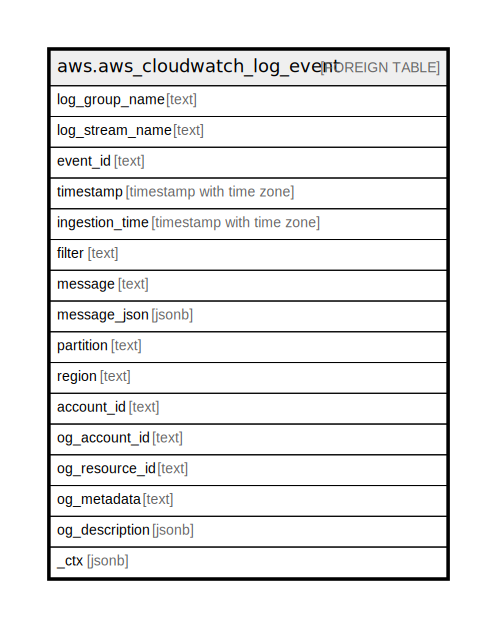

# aws.aws_cloudwatch_log_event

## Description

AWS CloudWatch Log Event

## Columns

| Name | Type | Default | Nullable | Children | Parents | Comment |
| ---- | ---- | ------- | -------- | -------- | ------- | ------- |
| log_group_name | text |  | true |  |  | The name of the log group to which this event belongs. |
| log_stream_name | text |  | true |  |  | The name of the log stream to which this event belongs. |
| event_id | text |  | true |  |  | The ID of the event. |
| timestamp | timestamp with time zone |  | true |  |  | The time when the event occurred. |
| ingestion_time | timestamp with time zone |  | true |  |  | The time when the event was ingested. |
| filter | text |  | true |  |  | Filter pattern for the search. |
| message | text |  | true |  |  | The data contained in the log event. |
| message_json | jsonb |  | true |  |  | The data contained in the log event in json format. Only if data is valid json string. |
| partition | text |  | true |  |  | The AWS partition in which the resource is located (aws, aws-cn, or aws-us-gov). |
| region | text |  | true |  |  | The AWS Region in which the resource is located. |
| account_id | text |  | true |  |  | The AWS Account ID in which the resource is located. |
| og_account_id | text |  | true |  |  | The Platform Account ID in which the resource is located. |
| og_resource_id | text |  | true |  |  | The unique ID of the resource in opengovernance. |
| og_metadata | text |  | true |  |  | Platform Metadata of the AWS resource. |
| og_description | jsonb |  | true |  |  | The full model description of the resource |
| _ctx | jsonb |  | true |  |  | Steampipe context in JSON form, e.g. connection_name. |

## Relations

---

> Generated by [tbls](https://github.com/k1LoW/tbls)
