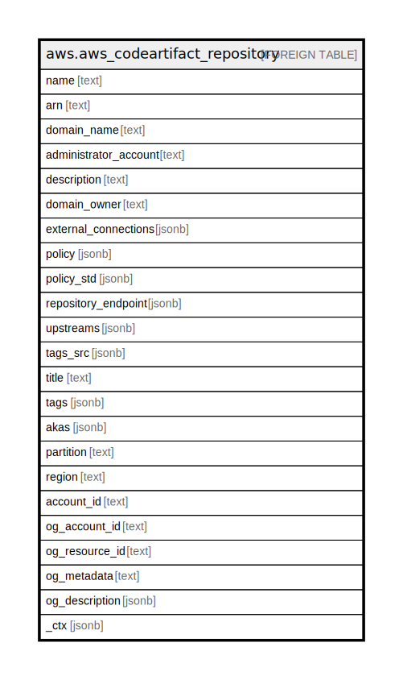

# aws.aws_codeartifact_repository

## Description

AWS CodeArtifact Repository

## Columns

| Name | Type | Default | Nullable | Children | Parents | Comment |
| ---- | ---- | ------- | -------- | -------- | ------- | ------- |
| name | text |  | true |  |  | The name of the repository. |
| arn | text |  | true |  |  | The Amazon Resource Name (ARN) of the repository |
| domain_name | text |  | true |  |  | The name of the domain that contains the repository. |
| administrator_account | text |  | true |  |  | The Amazon Web Services account ID that manages the repository. |
| description | text |  | true |  |  | The description of the repository. |
| domain_owner | text |  | true |  |  | The 12-digit account number of the Amazon Web Services account that owns the repository. It does not include dashes or spaces. |
| external_connections | jsonb |  | true |  |  | An array of external connections associated with the repository. |
| policy | jsonb |  | true |  |  | An CodeArtifact resource policy that contains a resource ARN, document details, and a revision. |
| policy_std | jsonb |  | true |  |  | Contains the contents of the resource-based policy in a canonical form for easier searching. |
| repository_endpoint | jsonb |  | true |  |  | A string that specifies the URL of the returned endpoint. |
| upstreams | jsonb |  | true |  |  | A list of upstream repositories to associate with the repository. |
| tags_src | jsonb |  | true |  |  | A list of tags assigned to the resource. |
| title | text |  | true |  |  | Title of the resource. |
| tags | jsonb |  | true |  |  | A map of tags for the resource. |
| akas | jsonb |  | true |  |  | Array of globally unique identifier strings (also known as) for the resource. |
| partition | text |  | true |  |  | The AWS partition in which the resource is located (aws, aws-cn, or aws-us-gov). |
| region | text |  | true |  |  | The AWS Region in which the resource is located. |
| account_id | text |  | true |  |  | The AWS Account ID in which the resource is located. |
| og_account_id | text |  | true |  |  | The Platform Account ID in which the resource is located. |
| og_resource_id | text |  | true |  |  | The unique ID of the resource in opengovernance. |
| og_metadata | text |  | true |  |  | Platform Metadata of the AWS resource. |
| og_description | jsonb |  | true |  |  | The full model description of the resource |
| _ctx | jsonb |  | true |  |  | Steampipe context in JSON form, e.g. connection_name. |

## Relations

---

> Generated by [tbls](https://github.com/k1LoW/tbls)
