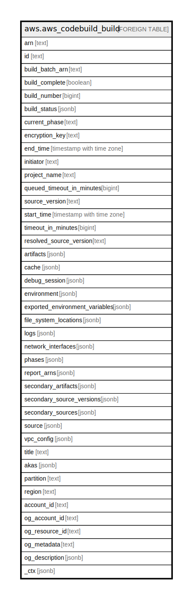

# aws.aws_codebuild_build

## Description

AWS CodeBuild Build

## Columns

| Name | Type | Default | Nullable | Children | Parents | Comment |
| ---- | ---- | ------- | -------- | -------- | ------- | ------- |
| arn | text |  | true |  |  | The ARN of the build. |
| id | text |  | true |  |  | The unique identifier of the  build. |
| build_batch_arn | text |  | true |  |  | The ARN of the batch build that this build is a member of, if applicable. |
| build_complete | boolean |  | true |  |  | Indicates if the build is complete. |
| build_number | bigint |  | true |  |  | The number of the build. |
| build_status | jsonb |  | true |  |  | The status of the build. |
| current_phase | text |  | true |  |  | The current build phase. |
| encryption_key | text |  | true |  |  | The Key Management Service customer master key (CMK) to be used for encrypting the build output artifacts. |
| end_time | timestamp with time zone |  | true |  |  | The date and time that the build process ended, expressed in Unix time format. |
| initiator | text |  | true |  |  | The entity that started the build. |
| project_name | text |  | true |  |  | The name of the build project. |
| queued_timeout_in_minutes | bigint |  | true |  |  | Specifies the amount of time, in minutes, that a build is allowed to be queued before it times out. |
| source_version | text |  | true |  |  | The identifier of the version of the source code to be built. |
| start_time | timestamp with time zone |  | true |  |  | The date and time that the build started. |
| timeout_in_minutes | bigint |  | true |  |  | How long, in minutes, for CodeBuild to wait before timing out this build if it does not get marked as completed. |
| resolved_source_version | text |  | true |  |  | The identifier of the resolved version of this build's source code. |
| artifacts | jsonb |  | true |  |  | A BuildArtifacts object the defines the build artifacts for this build. |
| cache | jsonb |  | true |  |  | Information about the cache for the build. |
| debug_session | jsonb |  | true |  |  | Contains information about the debug session for this build. |
| environment | jsonb |  | true |  |  | Information about the build environment for this build project. |
| exported_environment_variables | jsonb |  | true |  |  | A list of exported environment variables for this build. |
| file_system_locations | jsonb |  | true |  |  | An array of ProjectFileSystemLocation objects for a CodeBuild build project. |
| logs | jsonb |  | true |  |  | Information about the build's logs in CloudWatch Logs. |
| network_interfaces | jsonb |  | true |  |  | Describes a network interface. |
| phases | jsonb |  | true |  |  | Information about all previous build phases that are complete and information about any current build phase that is not yet complete. |
| report_arns | jsonb |  | true |  |  | An array of the ARNs associated with this build's reports. |
| secondary_artifacts | jsonb |  | true |  |  | An array of BuildArtifacts objects the define the build artifacts for this build. |
| secondary_source_versions | jsonb |  | true |  |  | An array of ProjectSourceVersion objects. |
| secondary_sources | jsonb |  | true |  |  | An array of ProjectSource objects that define the sources for the build. |
| source | jsonb |  | true |  |  | Information about the build input source code for the build project. |
| vpc_config | jsonb |  | true |  |  | Information about the VPC configuration that CodeBuild accesses. |
| title | text |  | true |  |  | Title of the resource. |
| akas | jsonb |  | true |  |  | Array of globally unique identifier strings (also known as) for the resource. |
| partition | text |  | true |  |  | The AWS partition in which the resource is located (aws, aws-cn, or aws-us-gov). |
| region | text |  | true |  |  | The AWS Region in which the resource is located. |
| account_id | text |  | true |  |  | The AWS Account ID in which the resource is located. |
| og_account_id | text |  | true |  |  | The Platform Account ID in which the resource is located. |
| og_resource_id | text |  | true |  |  | The unique ID of the resource in opengovernance. |
| og_metadata | text |  | true |  |  | Platform Metadata of the AWS resource. |
| og_description | jsonb |  | true |  |  | The full model description of the resource |
| _ctx | jsonb |  | true |  |  | Steampipe context in JSON form, e.g. connection_name. |

## Relations

---

> Generated by [tbls](https://github.com/k1LoW/tbls)
