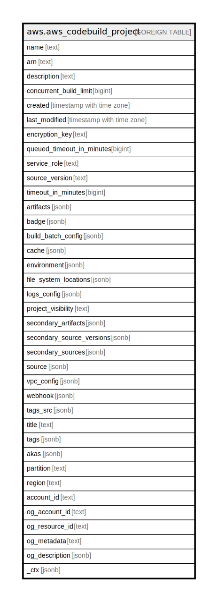

# aws.aws_codebuild_project

## Description

AWS CodeBuild Project

## Columns

| Name | Type | Default | Nullable | Children | Parents | Comment |
| ---- | ---- | ------- | -------- | -------- | ------- | ------- |
| name | text |  | true |  |  | The name of the build project. |
| arn | text |  | true |  |  | The Amazon Resource Name (ARN) of the build project. |
| description | text |  | true |  |  | A description that makes the build project easy to identify. |
| concurrent_build_limit | bigint |  | true |  |  | The maximum number of concurrent builds that are allowed for this project. |
| created | timestamp with time zone |  | true |  |  | When the build project was created, expressed in Unix time format. |
| last_modified | timestamp with time zone |  | true |  |  | When the build project's settings were last modified, expressed in Unix time format. |
| encryption_key | text |  | true |  |  | The AWS Key Management Service (AWS KMS) customer master key (CMK) to be. |
| queued_timeout_in_minutes | bigint |  | true |  |  | The number of minutes a build is allowed to be queued before it times out. |
| service_role | text |  | true |  |  | The ARN of the AWS Identity and Access Management (IAM) role that enables AWS CodeBuild to interact with dependent AWS services on behalf of the AWS account. |
| source_version | text |  | true |  |  | A version of the build input to be built for this project. |
| timeout_in_minutes | bigint |  | true |  |  | How long, in minutes, from 5 to 480 (8 hours), for AWS CodeBuild to wait before timing out any related build that did not get marked as completed. |
| artifacts | jsonb |  | true |  |  | Information about the build output artifacts for the build project. |
| badge | jsonb |  | true |  |  | Information about the build badge for the build project. |
| build_batch_config | jsonb |  | true |  |  | A ProjectBuildBatchConfig object that defines the batch build options for the project. |
| cache | jsonb |  | true |  |  | Information about the cache for the build project. |
| environment | jsonb |  | true |  |  | Information about the build environment for this build project. |
| file_system_locations | jsonb |  | true |  |  | An array of ProjectFileSystemLocation objects for a CodeBuild build project. |
| logs_config | jsonb |  | true |  |  | Information about logs for the build project. A project can create logs in Amazon CloudWatch Logs, an S3 bucket or both. |
| project_visibility | text |  | true |  |  | Visibility of the build project. |
| secondary_artifacts | jsonb |  | true |  |  | An array of ProjectArtifacts objects. |
| secondary_source_versions | jsonb |  | true |  |  | An array of ProjectSource objects. |
| secondary_sources | jsonb |  | true |  |  | An array of ProjectSource objects. |
| source | jsonb |  | true |  |  | Information about the build input source code for this build project. |
| vpc_config | jsonb |  | true |  |  | Information about the VPC configuration that AWS CodeBuild accesses. |
| webhook | jsonb |  | true |  |  |  Information about a webhook that connects repository events to a build project in AWS CodeBuild. |
| tags_src | jsonb |  | true |  |  | A list of tag key and value pairs associated with this build project. |
| title | text |  | true |  |  | Title of the resource. |
| tags | jsonb |  | true |  |  | A map of tags for the resource. |
| akas | jsonb |  | true |  |  | Array of globally unique identifier strings (also known as) for the resource. |
| partition | text |  | true |  |  | The AWS partition in which the resource is located (aws, aws-cn, or aws-us-gov). |
| region | text |  | true |  |  | The AWS Region in which the resource is located. |
| account_id | text |  | true |  |  | The AWS Account ID in which the resource is located. |
| og_account_id | text |  | true |  |  | The Platform Account ID in which the resource is located. |
| og_resource_id | text |  | true |  |  | The unique ID of the resource in opengovernance. |
| og_metadata | text |  | true |  |  | Platform Metadata of the AWS resource. |
| og_description | jsonb |  | true |  |  | The full model description of the resource |
| _ctx | jsonb |  | true |  |  | Steampipe context in JSON form, e.g. connection_name. |

## Relations

---

> Generated by [tbls](https://github.com/k1LoW/tbls)
