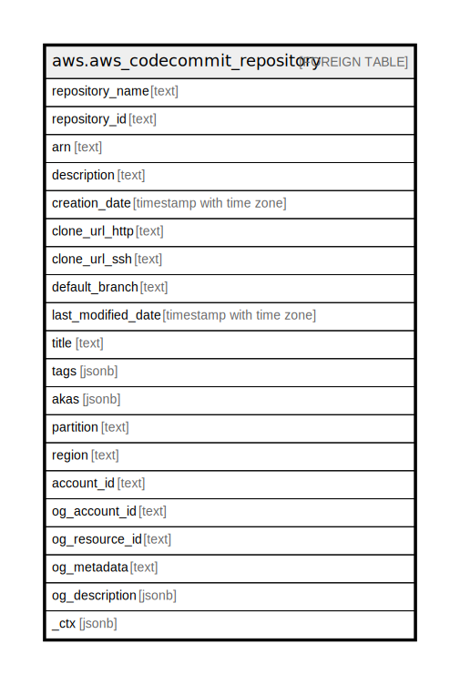

# aws.aws_codecommit_repository

## Description

AWS CodeCommit Repository

## Columns

| Name | Type | Default | Nullable | Children | Parents | Comment |
| ---- | ---- | ------- | -------- | -------- | ------- | ------- |
| repository_name | text |  | true |  |  | The repository's name. |
| repository_id | text |  | true |  |  | The ID of the repository. |
| arn | text |  | true |  |  | The Amazon Resource Name (ARN) of the repository. |
| description | text |  | true |  |  | A comment or description about the repository. |
| creation_date | timestamp with time zone |  | true |  |  | The date and time the repository was created. |
| clone_url_http | text |  | true |  |  | The URL to use for cloning the repository over HTTPS. |
| clone_url_ssh | text |  | true |  |  | The URL to use for cloning the repository over SSH. |
| default_branch | text |  | true |  |  | The repository's default branch name. |
| last_modified_date | timestamp with time zone |  | true |  |  | The date and time the repository was last modified. |
| title | text |  | true |  |  | Title of the resource. |
| tags | jsonb |  | true |  |  | A map of tags for the resource. |
| akas | jsonb |  | true |  |  | Array of globally unique identifier strings (also known as) for the resource. |
| partition | text |  | true |  |  | The AWS partition in which the resource is located (aws, aws-cn, or aws-us-gov). |
| region | text |  | true |  |  | The AWS Region in which the resource is located. |
| account_id | text |  | true |  |  | The AWS Account ID in which the resource is located. |
| og_account_id | text |  | true |  |  | The Platform Account ID in which the resource is located. |
| og_resource_id | text |  | true |  |  | The unique ID of the resource in opengovernance. |
| og_metadata | text |  | true |  |  | Platform Metadata of the AWS resource. |
| og_description | jsonb |  | true |  |  | The full model description of the resource |
| _ctx | jsonb |  | true |  |  | Steampipe context in JSON form, e.g. connection_name. |

## Relations

---

> Generated by [tbls](https://github.com/k1LoW/tbls)
