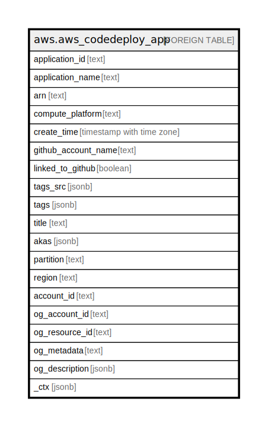

# aws.aws_codedeploy_app

## Description

AWS CodeDeploy Application

## Columns

| Name | Type | Default | Nullable | Children | Parents | Comment |
| ---- | ---- | ------- | -------- | -------- | ------- | ------- |
| application_id | text |  | true |  |  | The application ID. |
| application_name | text |  | true |  |  | The application name. |
| arn | text |  | true |  |  | The Amazon Resource Name (ARN) specifying the application. |
| compute_platform | text |  | true |  |  | The destination platform type for deployment of the application (Lambda or Server). |
| create_time | timestamp with time zone |  | true |  |  | The time at which the application was created. |
| github_account_name | text |  | true |  |  | The name for a connection to a GitHub account. |
| linked_to_github | boolean |  | true |  |  | True if the user has authenticated with GitHub for the specified application. Otherwise, false. |
| tags_src | jsonb |  | true |  |  | A list of tag key and value pairs associated with this application. |
| tags | jsonb |  | true |  |  | A map of tags for the resource. |
| title | text |  | true |  |  | Title of the resource. |
| akas | jsonb |  | true |  |  | Array of globally unique identifier strings (also known as) for the resource. |
| partition | text |  | true |  |  | The AWS partition in which the resource is located (aws, aws-cn, or aws-us-gov). |
| region | text |  | true |  |  | The AWS Region in which the resource is located. |
| account_id | text |  | true |  |  | The AWS Account ID in which the resource is located. |
| og_account_id | text |  | true |  |  | The Platform Account ID in which the resource is located. |
| og_resource_id | text |  | true |  |  | The unique ID of the resource in opengovernance. |
| og_metadata | text |  | true |  |  | Platform Metadata of the AWS resource. |
| og_description | jsonb |  | true |  |  | The full model description of the resource |
| _ctx | jsonb |  | true |  |  | Steampipe context in JSON form, e.g. connection_name. |

## Relations

---

> Generated by [tbls](https://github.com/k1LoW/tbls)
