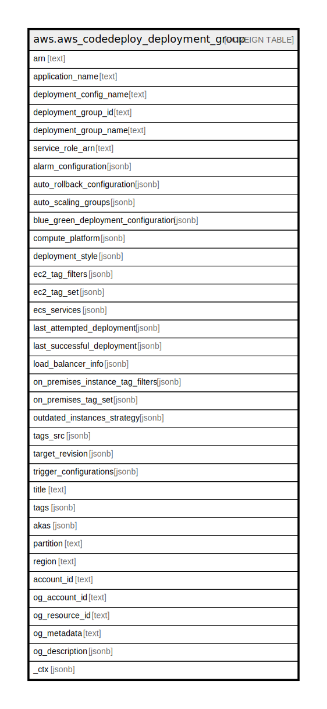

# aws.aws_codedeploy_deployment_group

## Description

AWS CodeDeploy DeploymentGroup

## Columns

| Name | Type | Default | Nullable | Children | Parents | Comment |
| ---- | ---- | ------- | -------- | -------- | ------- | ------- |
| arn | text |  | true |  |  | The Amazon Resource Name (ARN) of the deployment group |
| application_name | text |  | true |  |  | The application name. |
| deployment_config_name | text |  | true |  |  | The deployment configuration name. |
| deployment_group_id | text |  | true |  |  | The deployment group ID. |
| deployment_group_name | text |  | true |  |  | The name of the deployment group. |
| service_role_arn | text |  | true |  |  | A service role Amazon Resource Name (ARN) that grants CodeDeploy permission to make calls to Amazon Web Services services on your behalf. |
| alarm_configuration | jsonb |  | true |  |  | A list of alarms associated with the deployment group. |
| auto_rollback_configuration | jsonb |  | true |  |  | Information about the automatic rollback configuration associated with the deployment group. |
| auto_scaling_groups | jsonb |  | true |  |  | A list of associated Auto Scaling groups. |
| blue_green_deployment_configuration | jsonb |  | true |  |  | Information about blue/green deployment options for a deployment group. |
| compute_platform | jsonb |  | true |  |  | The destination platform type for the deployment (Lambda, Server, or ECS). |
| deployment_style | jsonb |  | true |  |  | Information about the type of deployment, either in-place or blue/green, you want to run and whether to route deployment traffic behind a load balancer. |
| ec2_tag_filters | jsonb |  | true |  |  | The Amazon EC2 tags on which to filter. The deployment group includes EC2 instances with any of the specified tags. |
| ec2_tag_set | jsonb |  | true |  |  | Information about groups of tags applied to an Amazon EC2 instance. |
| ecs_services | jsonb |  | true |  |  | The target Amazon ECS services in the deployment group. |
| last_attempted_deployment | jsonb |  | true |  |  | Information about the most recent attempted deployment to the deployment group. |
| last_successful_deployment | jsonb |  | true |  |  | Information about the most recent successful deployment to the deployment group. |
| load_balancer_info | jsonb |  | true |  |  | Information about the load balancer to use in a deployment. |
| on_premises_instance_tag_filters | jsonb |  | true |  |  | The on-premises instance tags on which to filter. |
| on_premises_tag_set | jsonb |  | true |  |  | Information about groups of tags applied to an on-premises instance. |
| outdated_instances_strategy | jsonb |  | true |  |  | Indicates what happens when new Amazon EC2 instances are launched mid-deployment and do not receive the deployed application revision. |
| tags_src | jsonb |  | true |  |  | A list of tags associated with deployment group. |
| target_revision | jsonb |  | true |  |  | Information about the deployment group's target revision, including type and location. |
| trigger_configurations | jsonb |  | true |  |  | Information about triggers associated with the deployment group. |
| title | text |  | true |  |  | Title of the resource. |
| tags | jsonb |  | true |  |  | A map of tags for the resource. |
| akas | jsonb |  | true |  |  | Array of globally unique identifier strings (also known as) for the resource. |
| partition | text |  | true |  |  | The AWS partition in which the resource is located (aws, aws-cn, or aws-us-gov). |
| region | text |  | true |  |  | The AWS Region in which the resource is located. |
| account_id | text |  | true |  |  | The AWS Account ID in which the resource is located. |
| og_account_id | text |  | true |  |  | The Platform Account ID in which the resource is located. |
| og_resource_id | text |  | true |  |  | The unique ID of the resource in opengovernance. |
| og_metadata | text |  | true |  |  | Platform Metadata of the AWS resource. |
| og_description | jsonb |  | true |  |  | The full model description of the resource |
| _ctx | jsonb |  | true |  |  | Steampipe context in JSON form, e.g. connection_name. |

## Relations

---

> Generated by [tbls](https://github.com/k1LoW/tbls)
