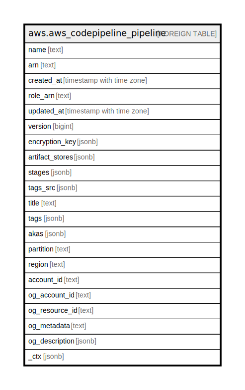

# aws.aws_codepipeline_pipeline

## Description

AWS Codepipeline Pipeline

## Columns

| Name | Type | Default | Nullable | Children | Parents | Comment |
| ---- | ---- | ------- | -------- | -------- | ------- | ------- |
| name | text |  | true |  |  | The name of the pipeline. |
| arn | text |  | true |  |  | The Amazon Resource Name (ARN) of the pipeline. |
| created_at | timestamp with time zone |  | true |  |  | The date and time the pipeline was created. |
| role_arn | text |  | true |  |  | The Amazon Resource Name (ARN) for AWS CodePipeline to use to either perform actions with no actionRoleArn, or to use to assume roles for actions with an actionRoleArn. |
| updated_at | timestamp with time zone |  | true |  |  | The date and time of the last update to the pipeline. |
| version | bigint |  | true |  |  | The version number of the pipeline. |
| encryption_key | jsonb |  | true |  |  | The encryption key used to encrypt the data in the artifact store, such as an AWS Key Management Service (AWS KMS) key. If this is undefined, the default key for Amazon S3 is used. |
| artifact_stores | jsonb |  | true |  |  | A mapping of artifactStore objects and their corresponding AWS Regions. There must be an artifact store for the pipeline Region and for each cross-region action in the pipeline. |
| stages | jsonb |  | true |  |  | The stage in which to perform the action. |
| tags_src | jsonb |  | true |  |  | A list of tag key and value pairs associated with this pipeline. |
| title | text |  | true |  |  | Title of the resource. |
| tags | jsonb |  | true |  |  | A map of tags for the resource. |
| akas | jsonb |  | true |  |  | Array of globally unique identifier strings (also known as) for the resource. |
| partition | text |  | true |  |  | The AWS partition in which the resource is located (aws, aws-cn, or aws-us-gov). |
| region | text |  | true |  |  | The AWS Region in which the resource is located. |
| account_id | text |  | true |  |  | The AWS Account ID in which the resource is located. |
| og_account_id | text |  | true |  |  | The Platform Account ID in which the resource is located. |
| og_resource_id | text |  | true |  |  | The unique ID of the resource in opengovernance. |
| og_metadata | text |  | true |  |  | Platform Metadata of the AWS resource. |
| og_description | jsonb |  | true |  |  | The full model description of the resource |
| _ctx | jsonb |  | true |  |  | Steampipe context in JSON form, e.g. connection_name. |

## Relations

---

> Generated by [tbls](https://github.com/k1LoW/tbls)
