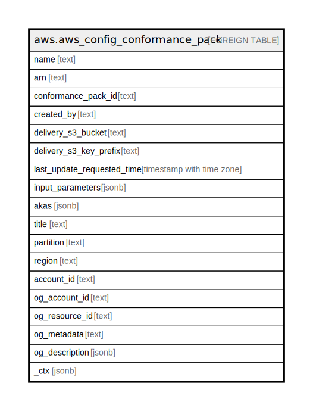

# aws.aws_config_conformance_pack

## Description

AWS Config Conformance Pack

## Columns

| Name | Type | Default | Nullable | Children | Parents | Comment |
| ---- | ---- | ------- | -------- | -------- | ------- | ------- |
| name | text |  | true |  |  | Name of the conformance pack. |
| arn | text |  | true |  |  | Amazon Resource Name (ARN) of the conformance pack. |
| conformance_pack_id | text |  | true |  |  | ID of the conformance pack. |
| created_by | text |  | true |  |  | AWS service that created the conformance pack. |
| delivery_s3_bucket | text |  | true |  |  | Amazon S3 bucket where AWS Config stores conformance pack templates. |
| delivery_s3_key_prefix | text |  | true |  |  | The prefix for the Amazon S3 delivery bucket. |
| last_update_requested_time | timestamp with time zone |  | true |  |  | Last update to the conformance pack. |
| input_parameters | jsonb |  | true |  |  | A list of ConformancePackInputParameter objects. |
| akas | jsonb |  | true |  |  | Array of globally unique identifier strings (also known as) for the resource. |
| title | text |  | true |  |  | Title of the resource. |
| partition | text |  | true |  |  | The AWS partition in which the resource is located (aws, aws-cn, or aws-us-gov). |
| region | text |  | true |  |  | The AWS Region in which the resource is located. |
| account_id | text |  | true |  |  | The AWS Account ID in which the resource is located. |
| og_account_id | text |  | true |  |  | The Platform Account ID in which the resource is located. |
| og_resource_id | text |  | true |  |  | The unique ID of the resource in opengovernance. |
| og_metadata | text |  | true |  |  | Platform Metadata of the AWS resource. |
| og_description | jsonb |  | true |  |  | The full model description of the resource |
| _ctx | jsonb |  | true |  |  | Steampipe context in JSON form, e.g. connection_name. |

## Relations

---

> Generated by [tbls](https://github.com/k1LoW/tbls)
