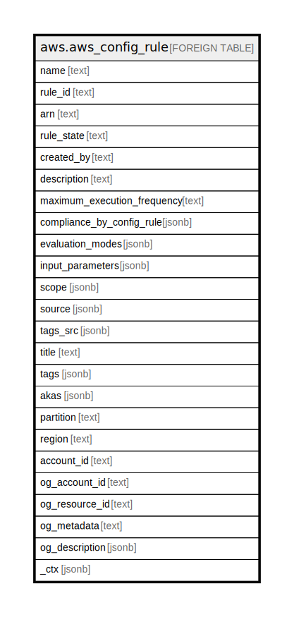

# aws.aws_config_rule

## Description

AWS Config Rule

## Columns

| Name | Type | Default | Nullable | Children | Parents | Comment |
| ---- | ---- | ------- | -------- | -------- | ------- | ------- |
| name | text |  | true |  |  | The name that you assign to the AWS Config rule. |
| rule_id | text |  | true |  |  | The ID of the AWS Config rule. |
| arn | text |  | true |  |  | The Amazon Resource Name (ARN) of the AWS Config rule. |
| rule_state | text |  | true |  |  | It indicate the evaluation status for the AWS Config rule. |
| created_by | text |  | true |  |  | Service principal name of the service that created the rule. |
| description | text |  | true |  |  | The description that you provide for the AWS Config rule. |
| maximum_execution_frequency | text |  | true |  |  | The maximum frequency with which AWS Config runs evaluations for a rule. |
| compliance_by_config_rule | jsonb |  | true |  |  | The compliance information of the config rule. |
| evaluation_modes | jsonb |  | true |  |  | The modes the Config rule can be evaluated in. The valid values are distinct objects. By default, the value is Detective evaluation mode only. |
| input_parameters | jsonb |  | true |  |  | A string, in JSON format, that is passed to the AWS Config rule Lambda function. |
| scope | jsonb |  | true |  |  | Defines which resources can trigger an evaluation for the rule. The scope can include one or more resource types, a combination of one resource type and one resource ID, or a combination of a tag key and value. Specify a scope to constrain the resources that can trigger an evaluation for the rule. If you do not specify a scope, evaluations are triggered when any resource in the recording group changes. |
| source | jsonb |  | true |  |  | Provides the rule owner (AWS or customer), the rule identifier, and the notifications that cause the function to evaluate your AWS resources. |
| tags_src | jsonb |  | true |  |  | A list of tags assigned to the rule. |
| title | text |  | true |  |  | Title of the resource. |
| tags | jsonb |  | true |  |  | A map of tags for the resource. |
| akas | jsonb |  | true |  |  | Array of globally unique identifier strings (also known as) for the resource. |
| partition | text |  | true |  |  | The AWS partition in which the resource is located (aws, aws-cn, or aws-us-gov). |
| region | text |  | true |  |  | The AWS Region in which the resource is located. |
| account_id | text |  | true |  |  | The AWS Account ID in which the resource is located. |
| og_account_id | text |  | true |  |  | The Platform Account ID in which the resource is located. |
| og_resource_id | text |  | true |  |  | The unique ID of the resource in opengovernance. |
| og_metadata | text |  | true |  |  | Platform Metadata of the AWS resource. |
| og_description | jsonb |  | true |  |  | The full model description of the resource |
| _ctx | jsonb |  | true |  |  | Steampipe context in JSON form, e.g. connection_name. |

## Relations

---

> Generated by [tbls](https://github.com/k1LoW/tbls)
