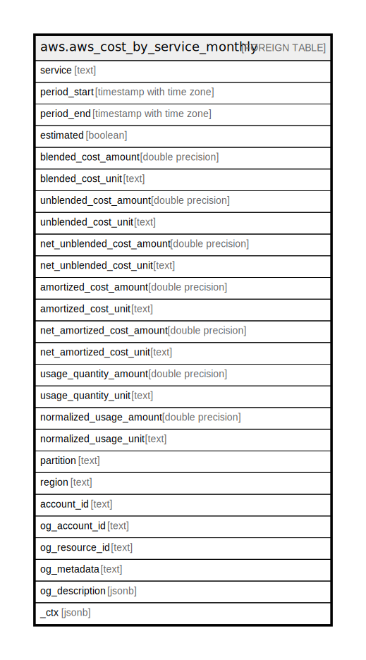

# aws.aws_cost_by_service_monthly

## Description

AWS Cost Explorer - Cost by Service (Monthly)

## Columns

| Name | Type | Default | Nullable | Children | Parents | Comment |
| ---- | ---- | ------- | -------- | -------- | ------- | ------- |
| service | text |  | true |  |  | The name of the AWS service. |
| period_start | timestamp with time zone |  | true |  |  | Start timestamp for this cost metric. |
| period_end | timestamp with time zone |  | true |  |  | End timestamp for this cost metric. |
| estimated | boolean |  | true |  |  | Whether the result is estimated. |
| blended_cost_amount | double precision |  | true |  |  | This cost metric reflects the average cost of usage across the consolidated billing family. If you use the consolidated billing feature in AWS Organizations, you can view costs using blended rates. |
| blended_cost_unit | text |  | true |  |  | Unit type for blended costs. |
| unblended_cost_amount | double precision |  | true |  |  | Unblended costs represent your usage costs on the day they are charged to you. In finance terms, they represent your costs on a cash basis of accounting. |
| unblended_cost_unit | text |  | true |  |  | Unit type for unblended costs. |
| net_unblended_cost_amount | double precision |  | true |  |  | This cost metric reflects the unblended cost after discounts. |
| net_unblended_cost_unit | text |  | true |  |  | Unit type for net unblended costs. |
| amortized_cost_amount | double precision |  | true |  |  | This cost metric reflects the effective cost of the upfront and monthly reservation fees spread across the billing period. By default, Cost Explorer shows the fees for Reserved Instances as a spike on the day that you're charged, but if you choose to show costs as amortized costs, the costs are amortized over the billing period. This means that the costs are broken out into the effective daily rate. AWS estimates your amortized costs by combining your unblended costs with the amortized portion of your upfront and recurring reservation fees. |
| amortized_cost_unit | text |  | true |  |  | Unit type for amortized costs. |
| net_amortized_cost_amount | double precision |  | true |  |  | This cost metric amortizes the upfront and monthly reservation fees while including discounts such as RI volume discounts. |
| net_amortized_cost_unit | text |  | true |  |  | Unit type for net amortized costs. |
| usage_quantity_amount | double precision |  | true |  |  | The amount of usage that you incurred. NOTE: If you return the UsageQuantity metric, the service aggregates all usage numbers without taking into account the units. For example, if you aggregate usageQuantity across all of Amazon EC2, the results aren't meaningful because Amazon EC2 compute hours and data transfer are measured in different units (for example, hours vs. GB). |
| usage_quantity_unit | text |  | true |  |  | Unit type for usage quantity. |
| normalized_usage_amount | double precision |  | true |  |  | The amount of usage that you incurred, in normalized units, for size-flexible RIs. The NormalizedUsageAmount is equal to UsageAmount multiplied by NormalizationFactor. |
| normalized_usage_unit | text |  | true |  |  | Unit type for normalized usage. |
| partition | text |  | true |  |  | The AWS partition in which the resource is located (aws, aws-cn, or aws-us-gov). |
| region | text |  | true |  |  | The AWS Region in which the resource is located. |
| account_id | text |  | true |  |  | The AWS Account ID in which the resource is located. |
| og_account_id | text |  | true |  |  | The Platform Account ID in which the resource is located. |
| og_resource_id | text |  | true |  |  | The unique ID of the resource in opengovernance. |
| og_metadata | text |  | true |  |  | Platform Metadata of the AWS resource. |
| og_description | jsonb |  | true |  |  | The full model description of the resource |
| _ctx | jsonb |  | true |  |  | Steampipe context in JSON form, e.g. connection_name. |

## Relations

---

> Generated by [tbls](https://github.com/k1LoW/tbls)
