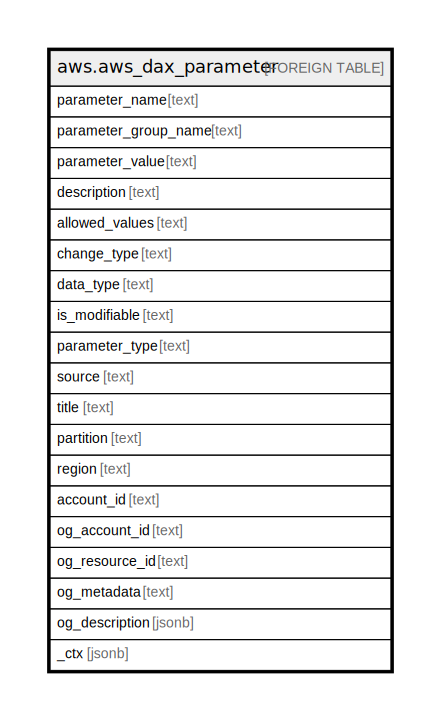

# aws.aws_dax_parameter

## Description

AWS DAX Parameter

## Columns

| Name | Type | Default | Nullable | Children | Parents | Comment |
| ---- | ---- | ------- | -------- | -------- | ------- | ------- |
| parameter_name | text |  | true |  |  | The name of the parameter. |
| parameter_group_name | text |  | true |  |  | The name of the parameter group. |
| parameter_value | text |  | true |  |  | The value of the parameter. |
| description | text |  | true |  |  | Description of the parameter. |
| allowed_values | text |  | true |  |  | A range of values within which the parameter can be set. |
| change_type | text |  | true |  |  | The conditions under which changes to this parameter can be applied. Possible values are 'IMMEDIATE', 'REQUIRES_REBOOT'. |
| data_type | text |  | true |  |  | The data type of the parameter. |
| is_modifiable | text |  | true |  |  | Whether the customer is allowed to modify the parameter. Possible values are 'TRUE', 'FALSE' 'CONDITIONAL'. |
| parameter_type | text |  | true |  |  | Determines whether the parameter can be applied to any node or only nodes of a particular type. Possible values are 'DEFAULT', 'NODE_TYPE_SPECIFIC'. |
| source | text |  | true |  |  | How the parameter is defined. For example, system denotes a system-defined parameter. |
| title | text |  | true |  |  | Title of the resource. |
| partition | text |  | true |  |  | The AWS partition in which the resource is located (aws, aws-cn, or aws-us-gov). |
| region | text |  | true |  |  | The AWS Region in which the resource is located. |
| account_id | text |  | true |  |  | The AWS Account ID in which the resource is located. |
| og_account_id | text |  | true |  |  | The Platform Account ID in which the resource is located. |
| og_resource_id | text |  | true |  |  | The unique ID of the resource in opengovernance. |
| og_metadata | text |  | true |  |  | Platform Metadata of the AWS resource. |
| og_description | jsonb |  | true |  |  | The full model description of the resource |
| _ctx | jsonb |  | true |  |  | Steampipe context in JSON form, e.g. connection_name. |

## Relations

---

> Generated by [tbls](https://github.com/k1LoW/tbls)
