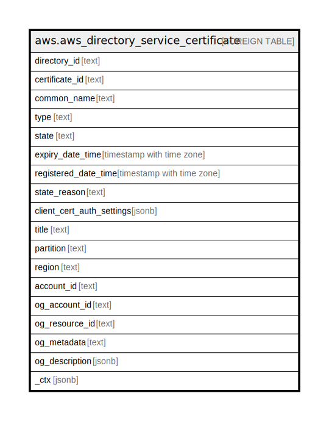

# aws.aws_directory_service_certificate

## Description

AWS Directory Service Certificate

## Columns

| Name | Type | Default | Nullable | Children | Parents | Comment |
| ---- | ---- | ------- | -------- | -------- | ------- | ------- |
| directory_id | text |  | true |  |  | The directory identifier. |
| certificate_id | text |  | true |  |  | The identifier of the certificate. |
| common_name | text |  | true |  |  | The common name for the certificate. |
| type | text |  | true |  |  | The function that the registered certificate performs. Valid values include ClientLDAPS or ClientCertAuth. The default value is ClientLDAPS. |
| state | text |  | true |  |  | The state of the certificate. Valid values: Registering | Registered | RegisterFailed | Deregistering | Deregistered | DeregisterFailed. |
| expiry_date_time | timestamp with time zone |  | true |  |  | The date and time when the certificate will expire. |
| registered_date_time | timestamp with time zone |  | true |  |  | The date and time that the certificate was registered. |
| state_reason | text |  | true |  |  | Describes a state change for the certificate. |
| client_cert_auth_settings | jsonb |  | true |  |  | A ClientCertAuthSettings object that contains client certificate authentication settings. |
| title | text |  | true |  |  | Title of the resource. |
| partition | text |  | true |  |  | The AWS partition in which the resource is located (aws, aws-cn, or aws-us-gov). |
| region | text |  | true |  |  | The AWS Region in which the resource is located. |
| account_id | text |  | true |  |  | The AWS Account ID in which the resource is located. |
| og_account_id | text |  | true |  |  | The Platform Account ID in which the resource is located. |
| og_resource_id | text |  | true |  |  | The unique ID of the resource in opengovernance. |
| og_metadata | text |  | true |  |  | Platform Metadata of the AWS resource. |
| og_description | jsonb |  | true |  |  | The full model description of the resource |
| _ctx | jsonb |  | true |  |  | Steampipe context in JSON form, e.g. connection_name. |

## Relations

---

> Generated by [tbls](https://github.com/k1LoW/tbls)
