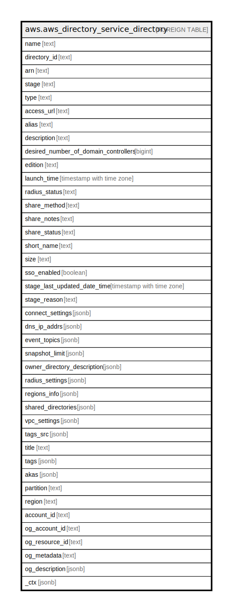

# aws.aws_directory_service_directory

## Description

AWS Directory Service Directory

## Columns

| Name | Type | Default | Nullable | Children | Parents | Comment |
| ---- | ---- | ------- | -------- | -------- | ------- | ------- |
| name | text |  | true |  |  | The fully qualified name of the directory. |
| directory_id | text |  | true |  |  | The directory identifier. |
| arn | text |  | true |  |  | The Amazon Resource Name (ARN) that uniquely identifies the directory. |
| stage | text |  | true |  |  | The current stage of the directory. |
| type | text |  | true |  |  | The directory type. |
| access_url | text |  | true |  |  | The access URL for the directory, such as http://<alias>.awsapps.com. |
| alias | text |  | true |  |  | The alias for the directory. |
| description | text |  | true |  |  | The description for the directory. |
| desired_number_of_domain_controllers | bigint |  | true |  |  | The desired number of domain controllers in the directory if the directory is Microsoft AD. |
| edition | text |  | true |  |  | The edition associated with this directory. |
| launch_time | timestamp with time zone |  | true |  |  | Specifies when the directory was created. |
| radius_status | text |  | true |  |  | The status of the RADIUS MFA server connection. |
| share_method | text |  | true |  |  | The method used when sharing a directory to determine whether the directory should be shared within your AWS organization (ORGANIZATIONS) or with any AWS account by sending a shared directory request (HANDSHAKE). |
| share_notes | text |  | true |  |  | A directory share request that is sent by the directory owner to the directory consumer. |
| share_status | text |  | true |  |  | Current directory status of the shared AWS Managed Microsoft AD directory. |
| short_name | text |  | true |  |  | The short name of the directory. |
| size | text |  | true |  |  | The directory size. |
| sso_enabled | boolean |  | true |  |  | Indicates if single sign-on is enabled for the directory. For more information, see EnableSso and DisableSso. |
| stage_last_updated_date_time | timestamp with time zone |  | true |  |  | The date and time that the stage was last updated. |
| stage_reason | text |  | true |  |  | Additional information about the directory stage. |
| connect_settings | jsonb |  | true |  |  | A DirectoryConnectSettingsDescription object that contains additional information about an AD Connector directory. |
| dns_ip_addrs | jsonb |  | true |  |  | The IP addresses of the DNS servers for the directory. |
| event_topics | jsonb |  | true |  |  | Amazon SNS topic names that receive status messages from the specified Directory ID. |
| snapshot_limit | jsonb |  | true |  |  | Obtains the manual snapshot limits for a directory. |
| owner_directory_description | jsonb |  | true |  |  | Describes the AWS Managed Microsoft AD directory in the directory owner account. |
| radius_settings | jsonb |  | true |  |  | A RadiusSettings object that contains information about the RADIUS server. |
| regions_info | jsonb |  | true |  |  | Lists the Regions where the directory has replicated. |
| shared_directories | jsonb |  | true |  |  | Details about the shared directory in the directory owner account for which the share request in the directory consumer account has been accepted. |
| vpc_settings | jsonb |  | true |  |  | A DirectoryVpcSettingsDescription object that contains additional information about a directory. |
| tags_src | jsonb |  | true |  |  | A list of tags currently associated with the Directory Service Directory. |
| title | text |  | true |  |  | Title of the resource. |
| tags | jsonb |  | true |  |  | A map of tags for the resource. |
| akas | jsonb |  | true |  |  | Array of globally unique identifier strings (also known as) for the resource. |
| partition | text |  | true |  |  | The AWS partition in which the resource is located (aws, aws-cn, or aws-us-gov). |
| region | text |  | true |  |  | The AWS Region in which the resource is located. |
| account_id | text |  | true |  |  | The AWS Account ID in which the resource is located. |
| og_account_id | text |  | true |  |  | The Platform Account ID in which the resource is located. |
| og_resource_id | text |  | true |  |  | The unique ID of the resource in opengovernance. |
| og_metadata | text |  | true |  |  | Platform Metadata of the AWS resource. |
| og_description | jsonb |  | true |  |  | The full model description of the resource |
| _ctx | jsonb |  | true |  |  | Steampipe context in JSON form, e.g. connection_name. |

## Relations

---

> Generated by [tbls](https://github.com/k1LoW/tbls)
