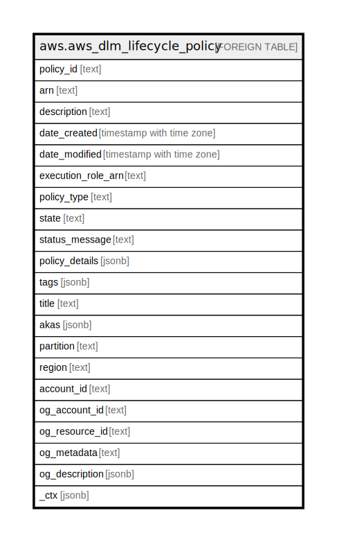

# aws.aws_dlm_lifecycle_policy

## Description

AWS DLM Lifecycle Policy

## Columns

| Name | Type | Default | Nullable | Children | Parents | Comment |
| ---- | ---- | ------- | -------- | -------- | ------- | ------- |
| policy_id | text |  | true |  |  | The identifier of the lifecycle policy. |
| arn | text |  | true |  |  | The Amazon Resource Name (ARN) of the policy. |
| description | text |  | true |  |  | The description of the lifecycle policy. |
| date_created | timestamp with time zone |  | true |  |  | The local date and time when the lifecycle policy was created. |
| date_modified | timestamp with time zone |  | true |  |  | The local date and time when the lifecycle policy was last modified. |
| execution_role_arn | text |  | true |  |  | The Amazon Resource Name (ARN) of the IAM role used to run the operations specified by the lifecycle policy. |
| policy_type | text |  | true |  |  | The type of policy. |
| state | text |  | true |  |  | The activation state of the lifecycle policy. |
| status_message | text |  | true |  |  | The description of the status. |
| policy_details | jsonb |  | true |  |  | The configuration of the lifecycle policy. |
| tags | jsonb |  | true |  |  | A map of tags for the resource. |
| title | text |  | true |  |  | Title of the resource. |
| akas | jsonb |  | true |  |  | Array of globally unique identifier strings (also known as) for the resource. |
| partition | text |  | true |  |  | The AWS partition in which the resource is located (aws, aws-cn, or aws-us-gov). |
| region | text |  | true |  |  | The AWS Region in which the resource is located. |
| account_id | text |  | true |  |  | The AWS Account ID in which the resource is located. |
| og_account_id | text |  | true |  |  | The Platform Account ID in which the resource is located. |
| og_resource_id | text |  | true |  |  | The unique ID of the resource in opengovernance. |
| og_metadata | text |  | true |  |  | Platform Metadata of the AWS resource. |
| og_description | jsonb |  | true |  |  | The full model description of the resource |
| _ctx | jsonb |  | true |  |  | Steampipe context in JSON form, e.g. connection_name. |

## Relations

---

> Generated by [tbls](https://github.com/k1LoW/tbls)
