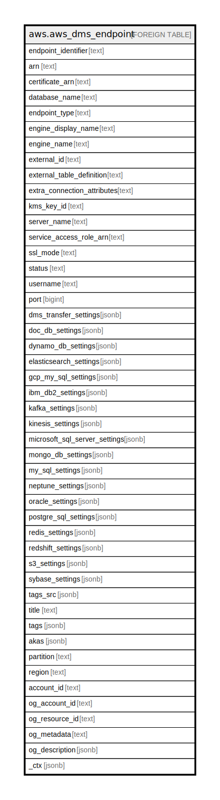

# aws.aws_dms_endpoint

## Description

AWS DMS Endpoint

## Columns

| Name | Type | Default | Nullable | Children | Parents | Comment |
| ---- | ---- | ------- | -------- | -------- | ------- | ------- |
| endpoint_identifier | text |  | true |  |  | The database endpoint identifier. |
| arn | text |  | true |  |  | The Amazon Resource Name (ARN) string that uniquely identifies the endpoint. |
| certificate_arn | text |  | true |  |  | The Amazon Resource Name (ARN) used for SSL connection to the endpoint. |
| database_name | text |  | true |  |  | The name of the database at the endpoint. |
| endpoint_type | text |  | true |  |  | The type of endpoint. Valid values are source and target. |
| engine_display_name | text |  | true |  |  | The expanded name for the engine name. For example, if the EngineName parameter is 'aurora', this value would be 'Amazon Aurora MySQL'. |
| engine_name | text |  | true |  |  | The database engine name. Valid values, depending on the EndpointType, include 'mysql', 'oracle', 'postgres', 'mariadb', 'aurora', 'aurora-postgresql', 'redshift', 's3', 'db2', 'db2-zos', 'azuredb', 'sybase', 'dynamodb', 'mongodb', 'kinesis', 'kafka', 'elasticsearch', 'documentdb', 'sqlserver', 'neptune', and 'babelfish'. |
| external_id | text |  | true |  |  | Value returned by a call to CreateEndpoint that can be used for cross-account validation. |
| external_table_definition | text |  | true |  |  | The external table definition. |
| extra_connection_attributes | text |  | true |  |  | Additional connection attributes used to connect to the endpoint. |
| kms_key_id | text |  | true |  |  | An KMS key identifier that is used to encrypt the connection parameters for the endpoint. |
| server_name | text |  | true |  |  | The name of the server at the endpoint. |
| service_access_role_arn | text |  | true |  |  | The Amazon Resource Name (ARN) used by the service to access the IAM role. |
| ssl_mode | text |  | true |  |  | The SSL mode used to connect to the endpoint. The default value is none. |
| status | text |  | true |  |  | The status of the endpoint. |
| username | text |  | true |  |  | The user name used to connect to the endpoint. |
| port | bigint |  | true |  |  | The port value used to access the endpoint. |
| dms_transfer_settings | jsonb |  | true |  |  | The settings for the DMS Transfer type source. |
| doc_db_settings | jsonb |  | true |  |  | Provides information that defines a DocumentDB endpoint. |
| dynamo_db_settings | jsonb |  | true |  |  | The settings for the DynamoDB target endpoint. |
| elasticsearch_settings | jsonb |  | true |  |  | The settings for the OpenSearch source endpoint. |
| gcp_my_sql_settings | jsonb |  | true |  |  | Settings in JSON format for the source GCP MySQL endpoint. |
| ibm_db2_settings | jsonb |  | true |  |  | The settings for the IBM Db2 LUW source endpoint. |
| kafka_settings | jsonb |  | true |  |  | The settings for the Apache Kafka target endpoint. |
| kinesis_settings | jsonb |  | true |  |  | The settings for the Amazon Kinesis target endpoint. |
| microsoft_sql_server_settings | jsonb |  | true |  |  | The settings for the Microsoft SQL Server source and target endpoint. |
| mongo_db_settings | jsonb |  | true |  |  | The settings for the MongoDB source endpoint. |
| my_sql_settings | jsonb |  | true |  |  | The settings for the MySQL source and target endpoint. |
| neptune_settings | jsonb |  | true |  |  | The settings for the Amazon Neptune target endpoint. |
| oracle_settings | jsonb |  | true |  |  | The settings for the Oracle source and target endpoint. |
| postgre_sql_settings | jsonb |  | true |  |  | The settings for the PostgreSQL source and target endpoint. |
| redis_settings | jsonb |  | true |  |  | The settings for the Redis target endpoint. |
| redshift_settings | jsonb |  | true |  |  | Settings for the Amazon Redshift endpoint. |
| s3_settings | jsonb |  | true |  |  | The settings for the S3 target endpoint. |
| sybase_settings | jsonb |  | true |  |  | The settings for the SAP ASE source and target endpoint. |
| tags_src | jsonb |  | true |  |  | A list of tags currently associated with the replication instance. |
| title | text |  | true |  |  | Title of the resource. |
| tags | jsonb |  | true |  |  | A map of tags for the resource. |
| akas | jsonb |  | true |  |  | Array of globally unique identifier strings (also known as) for the resource. |
| partition | text |  | true |  |  | The AWS partition in which the resource is located (aws, aws-cn, or aws-us-gov). |
| region | text |  | true |  |  | The AWS Region in which the resource is located. |
| account_id | text |  | true |  |  | The AWS Account ID in which the resource is located. |
| og_account_id | text |  | true |  |  | The Platform Account ID in which the resource is located. |
| og_resource_id | text |  | true |  |  | The unique ID of the resource in opengovernance. |
| og_metadata | text |  | true |  |  | Platform Metadata of the AWS resource. |
| og_description | jsonb |  | true |  |  | The full model description of the resource |
| _ctx | jsonb |  | true |  |  | Steampipe context in JSON form, e.g. connection_name. |

## Relations

---

> Generated by [tbls](https://github.com/k1LoW/tbls)
