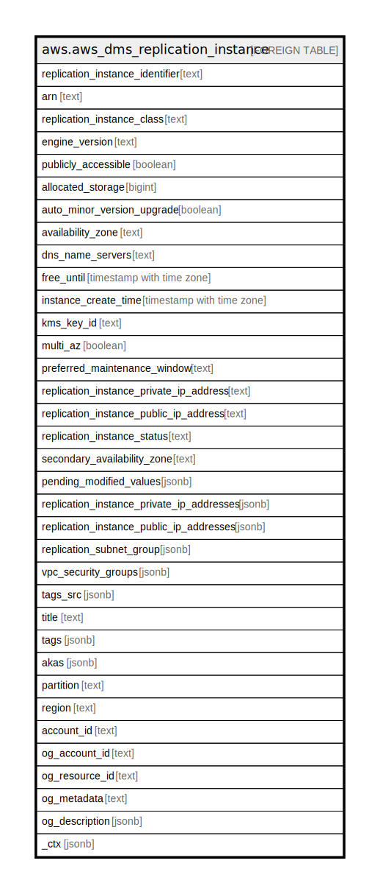

# aws.aws_dms_replication_instance

## Description

AWS DMS Replication Instance

## Columns

| Name | Type | Default | Nullable | Children | Parents | Comment |
| ---- | ---- | ------- | -------- | -------- | ------- | ------- |
| replication_instance_identifier | text |  | true |  |  | The identifier of the replication instance. |
| arn | text |  | true |  |  | The Amazon Resource Name (ARN) of the replication instance. |
| replication_instance_class | text |  | true |  |  | The compute and memory capacity of the replication instance as defined for the specified replication instance class. |
| engine_version | text |  | true |  |  | The engine version number of the replication instance. |
| publicly_accessible | boolean |  | true |  |  | Specifies the accessibility options for the replication instance. |
| allocated_storage | bigint |  | true |  |  | The amount of storage (in gigabytes) that is allocated for the replication instance. |
| auto_minor_version_upgrade | boolean |  | true |  |  | Boolean value indicating if minor version upgrades will be automatically applied to the instance. |
| availability_zone | text |  | true |  |  | The Availability Zone for the instance. |
| dns_name_servers | text |  | true |  |  | The DNS name servers supported for the replication instance to access your on-premise source or target database. |
| free_until | timestamp with time zone |  | true |  |  | The expiration date of the free replication instance that is part of the Free DMS program. |
| instance_create_time | timestamp with time zone |  | true |  |  | The time the replication instance was created. |
| kms_key_id | text |  | true |  |  | An AWS KMS key identifier that is used to encrypt the data on the replication instance. |
| multi_az | boolean |  | true |  |  | Specifies whether the replication instance is a Multi-AZ deployment. |
| preferred_maintenance_window | text |  | true |  |  | The maintenance window times for the replication instance. |
| replication_instance_private_ip_address | text |  | true |  |  | The private IP address of the replication instance. |
| replication_instance_public_ip_address | text |  | true |  |  | The public IP address of the replication instance. |
| replication_instance_status | text |  | true |  |  | The status of the replication instance. |
| secondary_availability_zone | text |  | true |  |  | The Availability Zone of the standby replication instance in a Multi-AZ deployment. |
| pending_modified_values | jsonb |  | true |  |  | The pending modification values. |
| replication_instance_private_ip_addresses | jsonb |  | true |  |  | One or more private IP addresses for the replication instance. |
| replication_instance_public_ip_addresses | jsonb |  | true |  |  | One or more public IP addresses for the replication instance. |
| replication_subnet_group | jsonb |  | true |  |  | The subnet group for the replication instance. |
| vpc_security_groups | jsonb |  | true |  |  | The VPC security group for the instance. |
| tags_src | jsonb |  | true |  |  | A list of tags currently associated with the replication instance. |
| title | text |  | true |  |  | Title of the resource. |
| tags | jsonb |  | true |  |  | A map of tags for the resource. |
| akas | jsonb |  | true |  |  | Array of globally unique identifier strings (also known as) for the resource. |
| partition | text |  | true |  |  | The AWS partition in which the resource is located (aws, aws-cn, or aws-us-gov). |
| region | text |  | true |  |  | The AWS Region in which the resource is located. |
| account_id | text |  | true |  |  | The AWS Account ID in which the resource is located. |
| og_account_id | text |  | true |  |  | The Platform Account ID in which the resource is located. |
| og_resource_id | text |  | true |  |  | The unique ID of the resource in opengovernance. |
| og_metadata | text |  | true |  |  | Platform Metadata of the AWS resource. |
| og_description | jsonb |  | true |  |  | The full model description of the resource |
| _ctx | jsonb |  | true |  |  | Steampipe context in JSON form, e.g. connection_name. |

## Relations

---

> Generated by [tbls](https://github.com/k1LoW/tbls)
