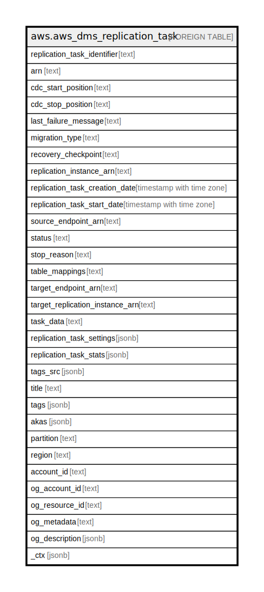

# aws.aws_dms_replication_task

## Description

AWS DMS Replication Task

## Columns

| Name | Type | Default | Nullable | Children | Parents | Comment |
| ---- | ---- | ------- | -------- | -------- | ------- | ------- |
| replication_task_identifier | text |  | true |  |  | The user-assigned replication task identifier or name. |
| arn | text |  | true |  |  | The Amazon Resource Name (ARN) of the replication task. |
| cdc_start_position | text |  | true |  |  | Indicates when you want a change data capture (CDC) operation to start. |
| cdc_stop_position | text |  | true |  |  | Indicates when you want a change data capture (CDC) operation to stop. |
| last_failure_message | text |  | true |  |  | The last error (failure) message generated for the replication task. |
| migration_type | text |  | true |  |  | The type of migration. |
| recovery_checkpoint | text |  | true |  |  | Indicates the last checkpoint that occurred during a change data capture (CDC) operation. |
| replication_instance_arn | text |  | true |  |  | The Amazon Resource Name (ARN) of the replication instance. |
| replication_task_creation_date | timestamp with time zone |  | true |  |  | The date the replication task was created. |
| replication_task_start_date | timestamp with time zone |  | true |  |  | The date the replication task is scheduled to start. |
| source_endpoint_arn | text |  | true |  |  | The Amazon Resource Name (ARN) that uniquely identifies the endpoint. |
| status | text |  | true |  |  | The status of the replication task. |
| stop_reason | text |  | true |  |  | The reason the replication task was stopped. |
| table_mappings | text |  | true |  |  | Table mappings specified in the task. |
| target_endpoint_arn | text |  | true |  |  | The ARN that uniquely identifies the endpoint. |
| target_replication_instance_arn | text |  | true |  |  | The ARN of the replication instance to which this task is moved in response to running the MoveReplicationTask operation. |
| task_data | text |  | true |  |  | Supplemental information that the task requires to migrate the data for certain source and target endpoints. |
| replication_task_settings | jsonb |  | true |  |  | The settings for the replication task. |
| replication_task_stats | jsonb |  | true |  |  | The statistics for the task, including elapsed time, tables loaded, and table errors. |
| tags_src | jsonb |  | true |  |  | A list of tags currently associated with the replication instance. |
| title | text |  | true |  |  | Title of the resource. |
| tags | jsonb |  | true |  |  | A map of tags for the resource. |
| akas | jsonb |  | true |  |  | Array of globally unique identifier strings (also known as) for the resource. |
| partition | text |  | true |  |  | The AWS partition in which the resource is located (aws, aws-cn, or aws-us-gov). |
| region | text |  | true |  |  | The AWS Region in which the resource is located. |
| account_id | text |  | true |  |  | The AWS Account ID in which the resource is located. |
| og_account_id | text |  | true |  |  | The Platform Account ID in which the resource is located. |
| og_resource_id | text |  | true |  |  | The unique ID of the resource in opengovernance. |
| og_metadata | text |  | true |  |  | Platform Metadata of the AWS resource. |
| og_description | jsonb |  | true |  |  | The full model description of the resource |
| _ctx | jsonb |  | true |  |  | Steampipe context in JSON form, e.g. connection_name. |

## Relations

---

> Generated by [tbls](https://github.com/k1LoW/tbls)
