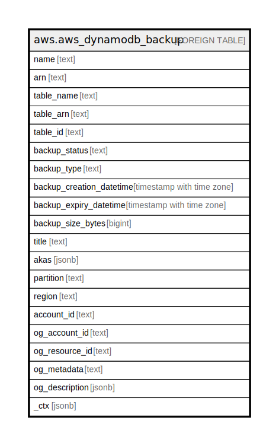

# aws.aws_dynamodb_backup

## Description

AWS DynamoDB Backup

## Columns

| Name | Type | Default | Nullable | Children | Parents | Comment |
| ---- | ---- | ------- | -------- | -------- | ------- | ------- |
| name | text |  | true |  |  | Name of the backup. |
| arn | text |  | true |  |  | Amazon Resource Name associated with the backup. |
| table_name | text |  | true |  |  | Unique identifier for the table to which backup belongs. |
| table_arn | text |  | true |  |  | Name of the table to which backup belongs. |
| table_id | text |  | true |  |  | ARN associated with the table to which backup belongs. |
| backup_status | text |  | true |  |  | Current status of the backup. Backup can be in one of the following states: CREATING, ACTIVE, DELETED. |
| backup_type | text |  | true |  |  | Backup type (USER | SYSTEM | AWS_BACKUP). |
| backup_creation_datetime | timestamp with time zone |  | true |  |  | Time at which the backup was created. |
| backup_expiry_datetime | timestamp with time zone |  | true |  |  | Time at which the automatic on-demand backup created by DynamoDB will expire. |
| backup_size_bytes | bigint |  | true |  |  | Size of the backup in bytes. |
| title | text |  | true |  |  | Title of the resource. |
| akas | jsonb |  | true |  |  | Array of globally unique identifier strings (also known as) for the resource. |
| partition | text |  | true |  |  | The AWS partition in which the resource is located (aws, aws-cn, or aws-us-gov). |
| region | text |  | true |  |  | The AWS Region in which the resource is located. |
| account_id | text |  | true |  |  | The AWS Account ID in which the resource is located. |
| og_account_id | text |  | true |  |  | The Platform Account ID in which the resource is located. |
| og_resource_id | text |  | true |  |  | The unique ID of the resource in opengovernance. |
| og_metadata | text |  | true |  |  | Platform Metadata of the AWS resource. |
| og_description | jsonb |  | true |  |  | The full model description of the resource |
| _ctx | jsonb |  | true |  |  | Steampipe context in JSON form, e.g. connection_name. |

## Relations

---

> Generated by [tbls](https://github.com/k1LoW/tbls)
