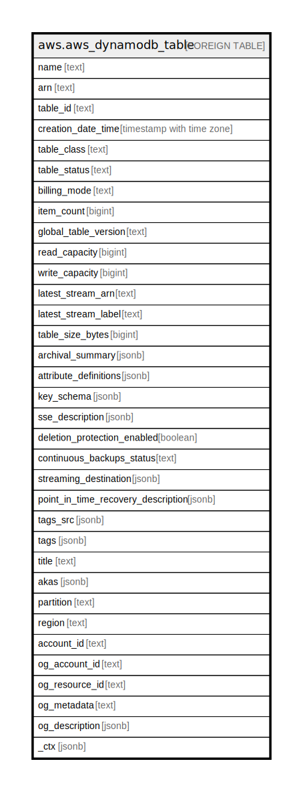

# aws.aws_dynamodb_table

## Description

AWS DynamoDB Table

## Columns

| Name | Type | Default | Nullable | Children | Parents | Comment |
| ---- | ---- | ------- | -------- | -------- | ------- | ------- |
| name | text |  | true |  |  | The name of the table. |
| arn | text |  | true |  |  | The Amazon Resource Name (ARN) that uniquely identifies the table. |
| table_id | text |  | true |  |  | Unique identifier for the table. |
| creation_date_time | timestamp with time zone |  | true |  |  | The date and time when the table was created. |
| table_class | text |  | true |  |  | The table class of the specified table. Valid values are STANDARD and STANDARD_INFREQUENT_ACCESS. |
| table_status | text |  | true |  |  | The current state of the table. |
| billing_mode | text |  | true |  |  | Controls how AWS charges for read and write throughput and manage capacity. |
| item_count | bigint |  | true |  |  | Number of items in the table. Note that this is an approximate value. |
| global_table_version | text |  | true |  |  | Represents the version of global tables (https://docs.aws.amazon.com/amazondynamodb/latest/developerguide/GlobalTables.html) in use, if the table is replicated across AWS Regions. |
| read_capacity | bigint |  | true |  |  | The maximum number of strongly consistent reads consumed per second before DynamoDB returns a ThrottlingException. |
| write_capacity | bigint |  | true |  |  | The maximum number of writes consumed per second before DynamoDB returns a ThrottlingException. |
| latest_stream_arn | text |  | true |  |  | The Amazon Resource Name (ARN) that uniquely identifies the latest stream for this table. |
| latest_stream_label | text |  | true |  |  | A timestamp, in ISO 8601 format, for this stream. |
| table_size_bytes | bigint |  | true |  |  | Size of the table in bytes. Note that this is an approximate value. |
| archival_summary | jsonb |  | true |  |  | Contains information about the table archive. |
| attribute_definitions | jsonb |  | true |  |  | An array of AttributeDefinition objects. Each of these objects describes one attribute in the table and index key schema. |
| key_schema | jsonb |  | true |  |  | The primary key structure for the table. |
| sse_description | jsonb |  | true |  |  | The description of the server-side encryption status on the specified table. |
| deletion_protection_enabled | boolean |  | true |  |  | Indicates whether deletion protection is enabled (true) or disabled (false) on the table. |
| continuous_backups_status | text |  | true |  |  | The continuous backups status of the table. ContinuousBackupsStatus can be one of the following states: ENABLED, DISABLED. |
| streaming_destination | jsonb |  | true |  |  | Provides information about the status of Kinesis streaming. |
| point_in_time_recovery_description | jsonb |  | true |  |  | The description of the point in time recovery settings applied to the table. |
| tags_src | jsonb |  | true |  |  | A list of tags assigned to the table. |
| tags | jsonb |  | true |  |  | A map of tags for the resource. |
| title | text |  | true |  |  | Title of the resource. |
| akas | jsonb |  | true |  |  | Array of globally unique identifier strings (also known as) for the resource. |
| partition | text |  | true |  |  | The AWS partition in which the resource is located (aws, aws-cn, or aws-us-gov). |
| region | text |  | true |  |  | The AWS Region in which the resource is located. |
| account_id | text |  | true |  |  | The AWS Account ID in which the resource is located. |
| og_account_id | text |  | true |  |  | The Platform Account ID in which the resource is located. |
| og_resource_id | text |  | true |  |  | The unique ID of the resource in opengovernance. |
| og_metadata | text |  | true |  |  | Platform Metadata of the AWS resource. |
| og_description | jsonb |  | true |  |  | The full model description of the resource |
| _ctx | jsonb |  | true |  |  | Steampipe context in JSON form, e.g. connection_name. |

## Relations

---

> Generated by [tbls](https://github.com/k1LoW/tbls)
