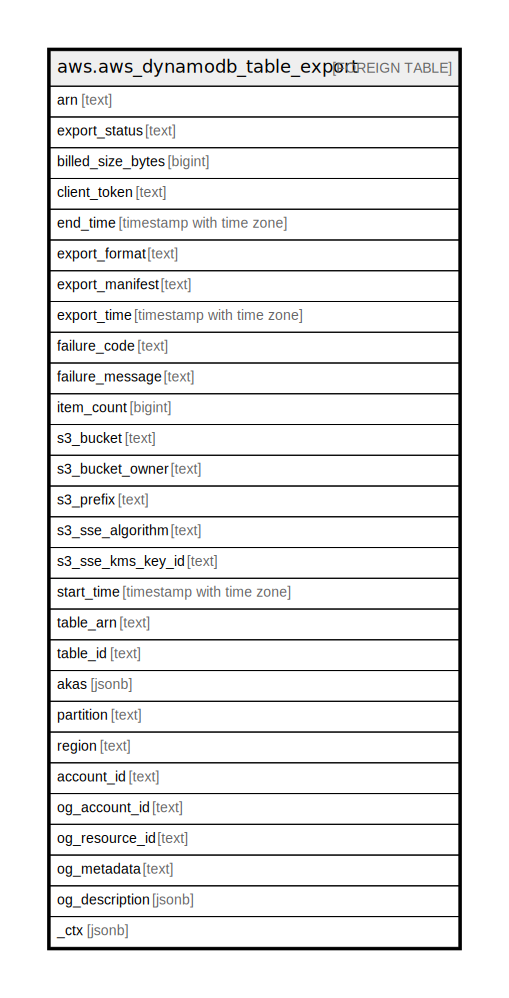

# aws.aws_dynamodb_table_export

## Description

AWS DynamoDB Table Export

## Columns

| Name | Type | Default | Nullable | Children | Parents | Comment |
| ---- | ---- | ------- | -------- | -------- | ------- | ------- |
| arn | text |  | true |  |  | The Amazon Resource Name (ARN) of the export. |
| export_status | text |  | true |  |  | Export can be in one of the following states: IN_PROGRESS, COMPLETED, or FAILED. |
| billed_size_bytes | bigint |  | true |  |  | The billable size of the table export. |
| client_token | text |  | true |  |  | The client token that was provided for the export task. A client token makes calls to ExportTableToPointInTimeInput idempotent, meaning that multiple identical calls have the same effect as one single call. |
| end_time | timestamp with time zone |  | true |  |  | The time at which the export task completed. |
| export_format | text |  | true |  |  | The format of the exported data. Valid values for ExportFormat are DYNAMODB_JSON or ION. |
| export_manifest | text |  | true |  |  | The name of the manifest file for the export task. |
| export_time | timestamp with time zone |  | true |  |  | Point in time from which table data was exported. |
| failure_code | text |  | true |  |  | Status code for the result of the failed export. |
| failure_message | text |  | true |  |  | Export failure reason description. |
| item_count | bigint |  | true |  |  | The number of items exported. |
| s3_bucket | text |  | true |  |  | The name of the Amazon S3 bucket containing the export. |
| s3_bucket_owner | text |  | true |  |  | The ID of the Amazon Web Services account that owns the bucket containing the export. |
| s3_prefix | text |  | true |  |  | The Amazon S3 bucket prefix used as the file name and path of the exported snapshot. |
| s3_sse_algorithm | text |  | true |  |  | Type of encryption used on the bucket where export data is stored. |
| s3_sse_kms_key_id | text |  | true |  |  | The ID of the KMS managed key used to encrypt the S3 bucket where export data is stored (if applicable). |
| start_time | timestamp with time zone |  | true |  |  | The time at which the export task began. |
| table_arn | text |  | true |  |  | The Amazon Resource Name (ARN) of the table that was exported. |
| table_id | text |  | true |  |  | Unique ID of the table that was exported. |
| akas | jsonb |  | true |  |  | Array of globally unique identifier strings (also known as) for the resource. |
| partition | text |  | true |  |  | The AWS partition in which the resource is located (aws, aws-cn, or aws-us-gov). |
| region | text |  | true |  |  | The AWS Region in which the resource is located. |
| account_id | text |  | true |  |  | The AWS Account ID in which the resource is located. |
| og_account_id | text |  | true |  |  | The Platform Account ID in which the resource is located. |
| og_resource_id | text |  | true |  |  | The unique ID of the resource in opengovernance. |
| og_metadata | text |  | true |  |  | Platform Metadata of the AWS resource. |
| og_description | jsonb |  | true |  |  | The full model description of the resource |
| _ctx | jsonb |  | true |  |  | Steampipe context in JSON form, e.g. connection_name. |

## Relations

---

> Generated by [tbls](https://github.com/k1LoW/tbls)
